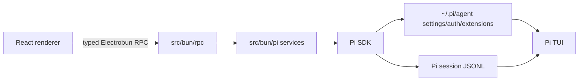

# Oh Your Pi 架构指南

## 目标

Oh Your Pi 是 Pi Coding Agent 的本地图形客户端，而不是另一套 Agent 实现。它必须直接复用用户现有 Pi CLI 的数据与资源：会话 JSONL、`~/.pi/agent` 设置、认证、模型、全局扩展、技能、提示模板和上下文文件。

## 不变量

1. **Pi 是唯一事实来源。** 不复制 `~/.pi/agent`，不迁移会话，不建立并行插件注册表。
2. **使用 SDK 默认发现。** 创建服务时传入用户选择的工作区 `cwd` 与 `getAgentDir()`；不得替换 `DefaultResourceLoader`，除非需求明确需要额外资源。
3. **会话路径是身份。** GUI 通过 `SessionManager.list/open/create/continueRecent` 操作 Pi 原生 JSONL。不要根据显示标题推断会话。
4. **单会话单写者。** 同一个 session 同时被 TUI 与 GUI 写入时可能出现竞争。读取可并行；恢复、发送消息、分支和压缩前必须确保没有另一客户端在写该 session。
5. **渲染进程无 Pi 权限。** React 不得直接导入 Pi SDK、读写文件、读取凭据或执行工具。所有操作经 Electrobun typed RPC 进入 Bun 主进程。
6. **RPC 只传 DTO。** `src/shared/pi-contract.ts` 中的 Zod schema 是跨进程边界；不得传 Pi SDK 类、错误对象、函数或原始事件对象。
7. **不把凭据传给 UI。** `auth.json`、token、API key 及原始设置仅在 Bun 主进程使用；UI 只能接收脱敏状态。

## 分层



- `src/shared/`：纯 Zod DTO 和 RPC schema；不得依赖 DOM、Bun 或 Pi SDK 的运行时代码。
- `src/bun/pi/`：Pi SDK 适配层。这里负责资源发现、会话运行时、事件规范化和生命周期。
- `src/bun/rpc/`：细粒度 Electrobun RPC handler；只校验输入、调用服务、返回 DTO。
- `src/mainview/lib/`：RPC client，不能出现业务状态。
- `src/mainview/features/`：按用户能力拆分，例如 `workspace`、`sessions`、`chat`、`settings`；每个 feature 管理自己的 UI 状态。
- `src/mainview/components/`：无业务语义的共享 UI 组件。

## 已落地的垂直切片

`workspace.inspect` 已可从 GUI 调用到 Bun：

1. 校验用户输入的工作区目录。
2. 用 `getAgentDir()` 和该工作区创建 Pi SDK services。
3. 让 `DefaultResourceLoader` 发现与 TUI 相同的全局/项目扩展、技能、模板与上下文。
4. 用 `SessionManager.list(workspacePath)` 读取同一项目的 Pi 会话。
5. 返回经 Zod 校验的会话摘要和资源计数。

`session.readTranscript` 是只读垂直切片：

1. 先验证请求的 session 路径属于所选工作区，拒绝任意本地文件路径。
2. 用 `SessionManager.open(sessionPath).getBranch()` 读取 Pi JSONL 当前叶子分支。
3. 规范化 user、assistant、tool result、Bash、可显示扩展消息和压缩/分支摘要为 DTO。
4. 不创建、恢复、分支或改写 session；TUI 与 GUI 可安全并行读取。

这验证了共享配置、共享会话索引、共享会话历史和可写 Agent 通路。

## 会话运行时

- 渲染进程拥有当前工作区、当前展示会话、已打开标签等 UI 状态；主进程不得保存 `activeWorkspace` 或 `activeSession`。
- 主进程按 workspace 缓存 `PiWorkspaceHost`，按 session 路径缓存 `PiSessionHost`。每个 live host 独立持有 SDK session、services、extension binding 和事件订阅。
- 切换 GUI 会话只改变 UI 选择；不得调用 `AgentSessionRuntime.switchSession()` 或 dispose 另一个 live session。
- `/new`、fork 与导入创建新的 `PiSessionHost`；fork 不得销毁父会话。关闭某个 host 时，只清理该会话的订阅和待授权请求。
- `ModelRuntime` 在同一 workspace 的 live session 间共享；cwd-bound services 仍按 session host 创建。
- 资源刷新只重建 idle host；streaming host 继续使用其已绑定资源。

## 后续迭代顺序

1. 增加会话标签、后台运行状态与闲置 host 的 LRU 回收策略。
2. 展示完整会话树并支持选择分支、fork 与导入。
3. 展示扩展/技能/诊断状态、文件选择、工具调用时间线、会话搜索与设置界面。

## 代码约定

- 顶层函数使用 `function` 和显式返回类型；React 组件使用明确的 `Props` 类型。
- 主进程 I/O 和 SDK 调用必须捕获为用户可见的、脱敏错误 DTO；不要把 stack 直接发送到 UI。
- session host 发生替换时，先 dispose 该 host 的旧 runtime，再重新订阅新 `runtime.session`；绝不影响其他 live session。
- 修改 Pi SDK API 前，先阅读本地 `node_modules/@earendil-works/pi-coding-agent/docs/sdk.md` 并核对当前安装版本。
- 修改跨进程接口时，同步更新 `pi-contract.ts`、`pi-rpc.ts`、Bun handler、renderer client 与调用方。

## 本地数据存储

- 客户端自定义用户数据 MUST 存放在 Pi 配置根目录下的 `oh-your-pi` 子目录；默认路径为 `~/.pi/oh-your-pi/`。不得另建独立的应用数据根目录。
- 窗口状态存放在 `~/.pi/oh-your-pi/window.json`，结构为 `{ "home": { "x": number, "y": number, "w": number, "h": number } }`。
- Home 窗口首次创建时 MUST 写入状态；移动或缩放后 MUST 更新状态；再次创建窗口前 MUST 读取并恢复状态。

## 验证

```bash
bun run typecheck
bunx vite build
bun run build
```

手动验证共享性时：在 Pi TUI 创建或重命名会话、安装/移除扩展后，重新读取同一工作区；GUI 必须显示 SDK 的最新结果，而不是缓存副本。

## 开发规约

- 除非我要求，否则你不能私自 run 应用
- 大部分时候，启动应用测试是我的事情，你只需要写好代码，然后反馈给我，让我去试就好了