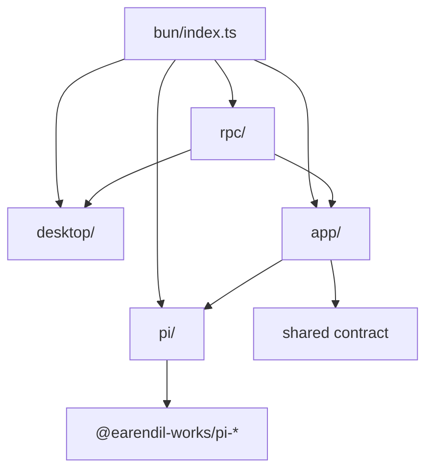

# Bun 主进程架构

## 职责

`src/bun/` 持有所有需要本机权限或 Pi SDK 的能力：

- BrowserWindow 和桌面系统调用。
- Electrobun RPC server。
- workspace、authentication、session 业务用例。
- Pi Coding Agent SDK 生命周期。
- workspace 文件访问和路径安全。
- 凭据、模型配置和 session 持久化访问。

## 目录结构

```text
src/bun/
├── index.ts
├── desktop/
│   ├── main-window.ts
│   ├── system.ts
│   ├── view-url.ts
│   └── window-state.ts
├── rpc/
│   ├── index.ts
│   └── index.test.ts
├── app/
│   ├── index.ts
│   ├── authentication/
│   ├── workspace/
│   └── session/
├── pi/
│   ├── index.ts
│   ├── runtime.ts
│   ├── authentication.ts
│   ├── workspace.ts
│   ├── errors.ts
│   └── session/
│       ├── index.ts
│       ├── session.ts
│       ├── registry.ts
│       ├── snapshot.ts
│       ├── events.ts
│       └── hooks.ts
└── utils/
    └── redact-sensitive-text.ts
```

## 依赖方向



静态规则：

- 只有 `pi/**` 导入 `@earendil-works/pi-*`。
- `pi/**` 不导入 `@shared/**`、Electrobun 或 `app/**`。
- `app/**` 只通过 `@main/pi` 使用 Pi SDK facade。
- `rpc/**` 只依赖 `Application`、`DesktopSystem` 和共享 RPC schema。
- `desktop/**` 不知道 workspace、session 或 authentication 业务。

## 组合根与生命周期

`src/bun/index.ts` 是唯一组合根，按固定顺序创建：

```text
registerPiOAuthFlows
  → PiRuntime.create
  → new Application(pi)
  → createDesktopSystem
  → createPiRpc
  → createMainWindow
```

生命周期：

- `PiRuntime` 和 `Application` 在主进程内各创建一次。
- macOS `reopen` 只重建窗口，复用 Pi、App 和 RPC。
- `before-quit` 先阻止默认退出，幂等释放 RPC subscriptions、App pending 状态和 Pi sessions，再调用 `Utils.quit()`。
- App dispose 先清理 session 业务状态和认证交互；Pi dispose 负责全部 live AgentSession。

## Desktop 适配层

### `desktop/main-window.ts`

创建 BrowserWindow，处理 move、resize 和 close；窗口级 `HomeWindowStateSaver` 负责调度和 flush frame。

### `desktop/view-url.ts`

开发 channel 优先等待 Vite `http://localhost:5173`，不可用时加载打包页面 `views://mainview/index.html`。

### `desktop/system.ts`

封装目录选择和外部链接：

- `chooseWorkspaceDirectory()`
- `openExternalUrl(url)`

### `desktop/window-state.ts`

窗口位置与尺寸保存在 `~/.pi/oh-your-pi/window.json`：

- 内存中使用 `{ x, y, width, height }`。
- 磁盘中使用 `{ home: { x, y, w, h } }`。
- move/resize 以 150 ms 防抖写入。
- 写入临时文件后 rename，目录和文件权限分别为 `0700`、`0600`。
- 缺失或非法状态返回默认 frame。

## RPC 适配层

`rpc/index.ts` 创建 `BrowserView.defineRPC<PiRpcSchema>()`，职责只有：

1. 将 request 转发到 `Application` 或 `DesktopSystem`。
2. 将 App subscription 转发为 webview message。
3. 在认证事件携带 URL 时调用 `desktop.openExternalUrl()`。
4. dispose 时退订全部 listener。

主要映射：

```text
inspectWorkspace           → app.inspectWorkspace
refreshWorkspaceResources  → app.refreshWorkspaceResources
authentication requests    → app.authentication
session requests           → app.session
workspace file requests    → app.workspace
chooseWorkspace            → desktop.chooseWorkspaceDirectory
```

主进程推送：

- `sessionEvent`
- `authenticationEvent`
- `toolPermissionRequest`

## App 业务层

### `app/index.ts`

`Application` 聚合三个平级能力：

```text
Application
├── AuthenticationApplication
├── WorkspaceApplication
└── SessionApplication
```

`inspectWorkspace()` 和 `refreshWorkspaceResources()` 在这里组合 resources、authentication 和 session summaries；workspace 模块本身不拥有认证或 live session 状态。

### `app/authentication/`

负责应用级认证交互：

- provider 状态映射。
- OAuth 与 API key 登录。
- 同一 provider 操作串行化。
- `AbortController` 和取消。
- text、secret、manual code、select prompt 的 pending promise。
- Pi auth event 到 RPC authentication event 的转换。
- dispose 时取消全部活跃登录和输入请求。

### `app/workspace/`

负责 workspace 用例：

- 打开并检查 Pi workspace resources。
- 汇总 extensions、skills、prompts、context files 和 diagnostics。
- refresh 时重建当前 workspace 的 idle sessions。
- 诊断内容在进入共享 DTO 前脱敏。
- 文件树与文件预览。

文件访问规则：

- lexical path 和 `realpath` 都必须位于 workspace root。
- 符号链接不能逃逸 workspace。
- 隐藏 `.git`、`node_modules` 和构建目录。
- 文件预览上限为 512 KiB。
- 二进制文件不作为 UTF-8 文本返回。

### `app/session/`

负责面向 Renderer 的 session 用例：

- list、read transcript、open、create、continue recent。
- set model、set thinking、prompt、steer、follow-up、abort。
- Pi snapshot 到共享 RPC DTO 的转换。
- Pi session event 到共享 event DTO 的转换。
- 工具授权 pending request。
- OAuth authentication-resolution failure 恢复。

`permissions.ts` 是应用策略：read、grep、find、ls 默认放行，其余工具请求 UI 决策；危险 bash 命令单独标记。Pi SDK 只接收中立的 before-tool-call decision。

`recovery.ts` 以 session path 保存 `retryable → awaiting-settle → recovering` 状态。仅明确的 authentication-resolution failure 进入恢复：回退失败 assistant 的父 entry、重新解析认证并调用 `session.continue()`。

## Pi SDK 边界

`pi/index.ts` 是 App 使用 Pi 能力的公共入口。生命周期能力直接由 class 表达：

- `PiRuntime`
- `PiAuthentication`
- `PiWorkspace`
- `PiSession`

公开数据类型与所属模块共置，不维护集中式 `types.ts`。

### `pi/runtime.ts`

- 创建唯一 `ModelRuntime`。
- 读取 `~/.pi/agent/auth.json` 和 `models.json`。
- 缓存规范化 workspace path 对应的 `PiWorkspace`。
- 持有全局 `PiSessionRegistry`。
- 统一关闭 session。

### `pi/workspace.ts`

- 校验并规范化 workspace path。
- 创建共享 `ModelRuntime` 下的 cwd-bound services。
- 读取 resources 和 diagnostics。
- 使用 `SessionManager` 列出、读取、打开、创建和继续 session。

### `pi/authentication.ts`

封装 `ModelRuntime.getProviders()`、`checkAuth()` 和 `login()`，输出与 UI/RPC 无关的认证状态、事件和交互 prompt。

### `pi/session/`

```text
session/
├── index.ts      # 子模块公共出口
├── session.ts    # AgentSession 生命周期与命令
├── registry.ts   # resolved sessionPath → PiSession
├── snapshot.ts   # session info、conversation、runtime snapshot
├── events.ts     # AgentSessionEvent → PiSessionEvent[]
└── hooks.ts      # tool_call extension adapter
```

核心不变量：

- 一个 `PiSession` 独占一个 live `AgentSession` 和一套 services。
- 同一规范化 session path 只对应一个 live `PiSession`。
- rebuild 只作用于 idle session，并恢复仍存在的 selected entry。
- `prompt()` 在 preflight 接受后返回；模型输出继续通过事件流发送。
- dispose 先发送 `session_shutdown`，再释放 AgentSession。

## 身份与状态所有权

| 状态 | 所有者 |
|---|---|
| `ModelRuntime` | `PiRuntime` |
| workspace cache | `PiRuntime` |
| live session map | `PiSessionRegistry` |
| AgentSession/services/subscription | `PiSession` |
| provider 操作队列、登录取消、认证输入 | `AuthenticationApplication` |
| 工具授权 pending promise | `ToolPermissionApplication` |
| OAuth 恢复状态 | `SessionRecovery` |
| RPC subscriptions | `PiRpcBinding` |
| BrowserWindow/frame saver | Desktop 层 |

## 安全边界

- 凭据和 auth 文件不离开 Pi SDK / 主进程。
- RPC 只发送 provider 可用性、认证类型和受控交互事件。
- resource diagnostics 与工具输入摘要在主进程脱敏。
- 文件访问在主进程验证 workspace 边界。
- Pi 错误在 `pi/errors.ts` 分类，App 不依赖上游错误类型。

## Import 与构建

主进程使用无 `/index` 后缀的目录入口：

```ts
import { Application } from "@main/app";
import { PiRuntime } from "@main/pi";
import { createPiRpc } from "@main/rpc";
```

`electrobun.config.ts` 的 Bun plugin 依次解析文件、带扩展名文件和目录入口文件，避免把目录路径直接交给 bundler。
