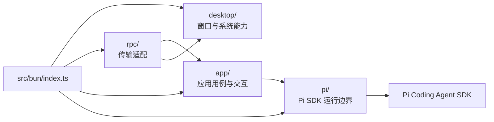
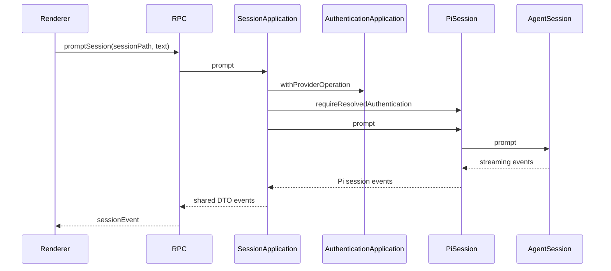

# Bun 主进程架构

## 职责

Bun 主进程是所有可信能力的 owner：Pi SDK、认证与凭据访问、工作区文件 I/O、活动会话、工具授权、桌面系统调用和窗口生命周期。Renderer 只能通过 RPC 请求这些能力。



依赖只能按图向右或向下流动：`pi/` 不依赖 `app/`、`rpc/` 或 `desktop/`；`app/` 不知道 Electrobun；`rpc/` 不实现业务规则。

对应局部 owner 文档：

- [`src/bun/pi/ai.prompt.md`](../src/bun/pi/ai.prompt.md)：Pi SDK runtime、workspace 与 live session 生命周期。
- [`src/bun/app/ai.prompt.md`](../src/bun/app/ai.prompt.md)：应用用例、DTO 映射与交互状态。
- [`src/bun/app/session/ai.prompt.md`](../src/bun/app/session/ai.prompt.md)：session event、工具授权与认证恢复状态机。

本文维护主进程跨模块依赖和端到端约束；修改单个 owner 时由对应局部文档维护实现语义。

## 当前源码结构

```text
src/bun/
├── index.ts                         # 进程组合根、窗口 reopen 与退出协调
├── desktop/
│   ├── main-window.ts               # BrowserWindow 创建与窗口事件
│   ├── window-state.ts              # home frame 持久化
│   ├── system.ts                    # 目录选择和外部 URL
│   └── view-url.ts                  # 开发/构建 View URL
├── rpc/
│   └── index.ts                     # Electrobun handler 与 message bridge
├── app/
│   ├── index.ts                     # Application 与完整 workspace snapshot
│   ├── authentication/              # provider 登录交互和串行化
│   ├── workspace/                   # 资源 DTO 与受限文件读取
│   └── session/                     # 会话用例、event、permission、recovery
├── pi/
│   ├── runtime.ts                   # ModelRuntime、workspace cache、registry
│   ├── authentication.ts            # Pi provider 能力
│   ├── workspace.ts                 # Pi resources 与持久 session 入口
│   ├── session/                     # AgentSession 生命周期与领域 event
│   └── errors.ts                    # 稳定错误分类
└── utils/
    └── redact-sensitive-text.ts     # 跨边界前的敏感文本脱敏
```

目录按真实 owner 划分，而不是按 request 名称拆文件。`index.ts` 只完成进程级装配；新增行为进入拥有状态和生命周期的目录，不把业务继续堆进入口或 RPC handler。

## 分层与所有权

### `pi/`：SDK 运行边界

- `PiRuntime` 创建并持有唯一 `ModelRuntime`、工作区缓存和 `PiSessionRegistry`。
- `PiWorkspace` 以规范化后的真实目录为身份，负责资源快照、持久 session 列表和 session 创建/打开。
- `PiSessionRegistry` 以规范化 `sessionPath` 保证活动 session 单实例，并处理并发打开、关闭、idle rebuild 和统一释放。
- 每个 `PiSession` 独占一个 `AgentSession` 及其 services，封装模型、thinking、prompt、事件订阅、重建和关闭。
- `PiAuthentication` 只包装 Pi `ModelRuntime` 的 provider 状态与登录能力，不持有 UI 交互状态。

`pi/` 对外使用自己的领域类型，不导入共享 RPC DTO。SDK 类型到应用 DTO 的转换属于 `app/`。

### `app/`：应用用例层

- `Application` 组合 authentication、workspace 和 session 三个应用服务，并组装完整工作区快照。
- `AuthenticationApplication` 持有 provider 级操作串行化、AbortController、待响应 prompt 和认证事件订阅。
- `WorkspaceApplication` 负责工作区资源 DTO、文件访问和进入 UI 前的诊断脱敏。
- `SessionApplication` 负责 session 用例、SDK 事件到 DTO 的转换、工具授权和一次性认证恢复。

应用层可以协调多个 Pi 能力，但不直接访问 Electrobun 或 React。

### `rpc/`：传输适配

`createPiRpc()` 是 Bun 端唯一 RPC binding：request 直接委派给 application/desktop owner，application event 转发为 WebView message，`dispose()` 解除所有订阅。这里不做重试、状态机、权限判断或 DTO 二次建模。

### `desktop/`：系统边界

窗口创建、窗口状态、目录选择器、外部 URL 和开发/生产 View URL 解析都属于 `desktop/`。Pi 和 application 层不得直接依赖 Electrobun 的窗口或系统 API。

### Desktop 与窗口状态

`createMainWindow()` 使用已保存 frame 或 `{ x: 200, y: 200, width: 1200, height: 800 }` 创建窗口。首次创建立即写入状态；move/resize 事件更新 frame 并由 `HomeWindowStateSaver` 以 150 ms 合并写入，close 前同步 flush。

macOS 关闭最后一个窗口后进程继续存在，`reopen` 创建新窗口并复用同一个 `PiRuntime`、Application 与 RPC binding。真正退出由 `before-quit` 协调；不得把窗口关闭等同于释放 Pi runtime。

`DesktopSystem` 是 application/RPC 可使用的最小系统能力，只暴露选择工作区目录和打开外部 URL。文件选择器、BrowserWindow 或 `Utils` 不进入 Pi 与 application 层。

## 会话调用链



`prompt()` 只等待 SDK 接受请求，不等待整轮生成完成；后续状态通过 event 流推进。`steer`、`followUp` 和 `abort` 只作用于已经由 registry 打开的 session。

## Workspace 与 Session 路由

所有 workspace 用例都携带显式 `workspacePath`，所有 live session 命令都携带持久 `sessionPath`。主进程不保存“当前工作区”或“当前活动会话”；UI 选择变化不能改变其他并行 session 的路由。

`PiRuntime.openWorkspace()` 对路径执行绝对化、目录检查和 `realpath`，然后按规范路径缓存 `PiWorkspace`。读取或打开已有 session 时，workspace 通过 Pi `SessionManager.list()` 查找真实 session 信息，不能接受任意 JSONL 路径作为活动会话。

资源刷新会重新检查 extensions、skills、prompts 和 context，并只重建该 workspace 中 idle 的 live session。运行中的 session 保持原 services，避免在生成过程中替换 extension runner。每个 session 的模型、thinking、transcript 和工具状态都来自自己的 `AgentSession`。

## 工具授权

Pi session 通过 extension hook 在工具执行前进入 `ToolPermissionApplication`：

- `read`、`grep`、`find`、`ls` 默认允许；其他工具请求 Renderer 明确授权。
- 没有活跃权限订阅者时默认拒绝，不能因 UI 缺席而放行。
- 传给 Renderer 的工具输入先脱敏并限制长度。
- application dispose 时，所有待处理请求以拒绝结束；失去 UI 订阅不能默认放行。
- 危险命令标记只影响 UI 警示，不替代用户授权。

## 认证与恢复

`registerPiOAuthFlows()` 必须在创建 `ModelRuntime` 前执行，保证打包后的 Bun 主进程能使用静态 OAuth loader。

同一 provider 的登录和 prompt 发送通过 `withProviderOperation()` 串行，避免登录刷新凭据与模型请求竞争。认证 URL 由 desktop owner 打开；device code、进度和交互式 prompt 作为事件发送给 Renderer；凭据本身从不离开 Pi runtime。

只有明确的 `authentication-resolution-failed` 可以触发恢复：回到失败 assistant message 的父节点，重新解析当前模型认证，然后调用一次 `agent.continue()`。通用模型错误、限流、工具错误和恢复自身失败都不重试。

认证交互由事件驱动：主进程可发送 auth URL、device code、信息、进度以及 text/secret/manual-code/select prompt。每个交互 prompt 使用唯一 ID 等待 Renderer response；取消 provider 登录会 abort 当前 flow，并拒绝该 provider 尚未回答的 prompt。

GitHub Copilot OAuth 在打包 GUI 中依赖 Bun 静态 flow 注册。恢复路径只处理已经分类为 `authentication-resolution-failed` 的失败：等待该轮 settle，导航到失败 assistant message 的父节点，重新解析认证并调用一次 `agent.continue()`。如果树节点不符合预期、认证仍不可用或 continue 失败，直接发送可见错误并清理恢复状态。

资源诊断和工具摘要只在 application 层转换为共享 DTO；认证文件内容、token、API key、SDK Error 对象和未脱敏输入不得进入 RPC message 或普通诊断日志。

## 生命周期

1. 入口注册 OAuth flows，创建 `PiRuntime`、`Application`、desktop system 和 RPC binding。
2. 主窗口关闭只释放窗口自身状态；macOS reopen 可以创建新窗口并复用进程级 runtime。
3. `before-quit` 首次阻止退出，解除 RPC/application 订阅并拒绝待处理交互，然后释放所有 `PiSession` 和 SDK services。
4. 清理完成后调用 `Utils.quit()`；所有 dispose 操作必须幂等。

## 安全边界

- 凭据、完整 `auth.json`、SDK 对象和原始敏感错误不进入 RPC DTO。
- 工作区文件路径必须由主进程解析并约束在目标 workspace 内。
- 外部 URL、文件选择器和窗口操作只通过 `DesktopSystem`。
- 资源诊断、工具输入和可见错误在跨进程前脱敏。

## 修改与验证

- SDK 行为变化：先核对当前安装版本文档、类型声明和实现，再修改 `pi/`。
- 新用例：放入对应 application owner；需要跨进程时再扩展 shared contract 和 RPC adapter。
- session 生命周期、认证、权限或恢复变化：运行对应 `src/bun/**` 测试及 `bun run verify`。
- OAuth、系统对话框、窗口 reopen/quit 或真实 provider 流程还需要打包桌面环境验证。
