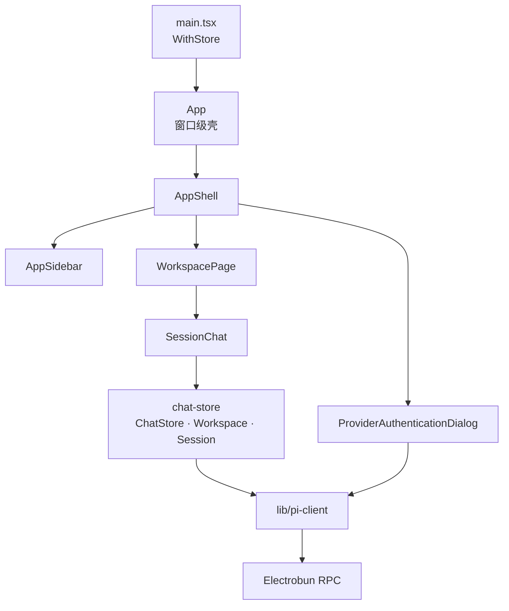
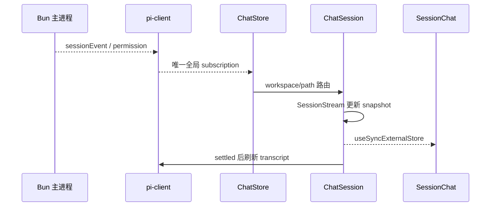

# React Renderer 架构

## 职责

Renderer 负责展示工作区、会话和认证状态，收集用户操作，并把意图发送给 Bun 主进程。它不解释 Pi session 文件、不访问凭据、不执行工具，也不复制 Pi SDK 的业务状态机。



对应局部 owner 文档：

- [`src/mainview/chat-store/ai.prompt.md`](../src/mainview/chat-store/ai.prompt.md)：workspace/session 长期内存、流、命令和 SessionView。
- [`src/mainview/biz/app/ai.prompt.md`](../src/mainview/biz/app/ai.prompt.md)：顶层组合与导航 Atom。
- [`src/mainview/biz/workspace/sessions/session/ai.prompt.md`](../src/mainview/biz/workspace/sessions/session/ai.prompt.md)：Chat Store 的会话 UI 适配。
- [`src/mainview/atom/ai.prompt.md`](../src/mainview/atom/ai.prompt.md)：Atom 完整 API 与使用方式。

本文维护 Renderer 跨 feature 的组合与依赖方向；单个 owner 的状态机和修改规则由对应局部文档维护。

## 当前源码结构

```text
src/mainview/
├── main.tsx                              # React root、WithStore、主题初始化
├── App.tsx                               # 窗口级视觉壳与 TooltipProvider
├── chat-store/                          # 全局 workspace/session 内存层、流状态与 SessionView
├── biz/
│   ├── app/
│   │   ├── AppShell.tsx                 # sidebar、workspace、认证弹窗组合
│   │   ├── preferences/                 # 浏览器侧 UI 偏好
│   │   └── sidebar/                     # 工作区切换与设置入口
│   ├── authentication/                  # provider 列表与登录步骤
│   └── workspace/
│       ├── index.tsx                    # 导航选择、files 与 sessions 区域协调
│       ├── files/                        # 文件树、读取与预览
│       └── sessions/
│           ├── SessionList.tsx
│           └── session/
│               ├── index.tsx            # ChatSession 到展示组件的适配
│               └── chat/                # transcript、消息、输入、模型与授权 UI
├── components/
│   ├── ui/                              # 跨业务 UI 基元
│   └── markdown-content.tsx             # Markdown 渲染
├── lib/
│   ├── pi-client.ts                     # 唯一 Electrobun client
│   └── theme.ts                         # 主题持久化
├── atom/                                # 小型共享状态基础设施
└── states/                              # 导航、认证、偏好和页面级 UI atom/mutation
```

目录结构表达业务组合关系。`biz/app` 可以组合 workspace 与 authentication；反向依赖禁止。files 和 sessions 是 workspace 下的同级域，不互相导入。

## 组合边界

### 应用壳

`App` 只提供窗口级视觉壳和全局 UI provider。`AppShell` 组合侧栏、工作区页面和认证弹窗，不保存 workspace/session 事实。

当前 workspace snapshot 和 selected session identity 属于导航 Atom。所有已经注册的 workspace/session、持久 transcript、runtime、当前轮增量、授权队列和命令状态属于进程级 `chatStore`。两者不能保存同一事实。

### 工作区域

`WorkspacePage` 只协调导航选择、session 列表、当前聊天和文件浏览器。选择身份形成后把 `workspacePath + sessionId + sessionPath` 交给 `SessionChat`；`SessionChat` 使用 `useChatSession()` acquire、打开并订阅稳定的 `ChatSessionSnapshot`。

组件卸载只 release consumer。后台 session 仍由 Chat Store 的唯一全局 event/permission subscription 推进，切回时直接复用 snapshot 和 `SessionView.items`。

### 认证

`ProviderAuthenticationDialog` 订阅认证交互事件，只维护当前弹窗步骤和用户输入。provider 摘要及登录后的 workspace/session 刷新由 `AuthenticationAtom` 协调；关闭弹窗时取消仍在进行的 provider 登录。

## Workspace 与认证交互

选择 workspace 后以主进程规范路径更新 `WorkspaceAtom` 并注册 `ChatWorkspace`；切换 workspace 只清除 selected session identity，不释放旧 workspace 的后台 session。创建、继续和打开 session 都由 Chat Store 执行，导航 mutation 只更新选择身份和 workspace 列表 snapshot。

文件区域由 `useWorkspaceFiles` 持有目录、选择和内容加载状态。认证完成后刷新资源，并让当前选择对应的 `ChatSession.reload()`；其他已缓存 session 保留各自生命周期。

## RPC 边界

`src/mainview/lib/pi-client.ts` 是 Renderer 唯一 Electrobun 接入点：

- 导出按业务命名的 request 函数。
- 导出 session、authentication 和 tool-permission event 订阅。
- 只使用 `@shared/pi-rpc` 与 `@shared/pi-contract` 类型。
- 不缓存业务状态、不重试、不解释 SDK 错误。

业务组件不得直接导入 `electrobun/view`、`src/bun` 或 Pi SDK。session RPC 只由 Chat Store 使用；其他能力先进入 `pi-client.ts`，再由真正 owner 调用。

## 状态策略

默认优先级：

1. workspace/session runtime、transcript、流、授权和命令：`chat-store/`。
2. 当前 workspace/session 导航身份、认证、偏好和跨区域 UI：`states/` Atom。
3. 父子组件协作：Props。
4. 单组件输入和视觉状态：`useState` / `useRef`。

禁止把 `ChatSessionSnapshot` 复制进 Atom 或 React state。浏览器持久化只用于主题、thinking 显示偏好和最近工作区。

### 模型、Thinking 与输入状态

当前模型、thinking、可选模型和 streaming 状态都来自 `ChatSessionSnapshot.openedSession.runtime`。`ModelThinkingSelector` 通过 `ChatSession.setModel()` / `setThinking()` 表达意图；运行和请求期间由 session snapshot 禁用冲突操作。

`SessionStream` 保存当前轮乐观 user message、assistant text/thinking delta、临时 tool 状态和 permission 队列；`agent_settled` 后由 `ChatSession` 刷新 transcript，并按 generation 清理对应增量。

完整 transcript 由 `SessionView` 编译并缓存为 `SessionViewItem[]`：普通 item 保留原 message index，toolCall 关联 toolResult，相邻调用合并为 tool section。`ChatTranscript` 不重复扫描消息。

## 事件与一致性



事件先由 ChatStore 路由到所属 workspace/session，再修改状态。界面当前选择不参与事件路由；并行后台 session 因此不会污染彼此。settle refresh 使用 generation，旧刷新不能清空后来启动的新流。

工具 permission request 也按 `sessionPath` 过滤，并在当前会话中排队逐个展示。Renderer 只有在主进程确认 response 成功后才移除请求；真正的 pending resolver、默认拒绝和危险命令判断始终属于 Bun 主进程。

## 依赖方向

- `biz/app` 可以组合 workspace 与 authentication；files 与 sessions 保持同级隔离。
- 业务 feature 可以依赖 `chat-store`、components、states、lib 和 shared DTO。
- `chat-store` 只能依赖 Renderer `lib/pi-client` 与 shared DTO，不能依赖业务组件或导航 Atom。
- 基础设施不得反向依赖业务 feature；不要新增第二套 session cache/controller。
- 真正跨业务复用的视觉原语进入 `components/`，传输和浏览器基础设施进入 `lib/`；不要新增含糊的 `biz/shared` 或 `biz/components`。
- 不为目录创建只做 re-export 的 barrel；目录入口本身承担真实组合职责时可以使用 `index.ts(x)`。

## 修改与验证

- Chat Store、事件处理或 session 交互变化：验证后台会话路由、切换后复用、旧刷新隔离和闲置淘汰。
- 流式 UI 变化：验证 assistant text、thinking、tool start/update/end、error、abort 与 settled 路径。
- 认证 UI 变化：验证 OAuth URL/device code、文本或 select prompt、取消和登录后当前 session reload。
- UI 行为使用真实 Renderer 路径检查；类型与构建最终运行 `bun run verify`。桌面 WebView 特有行为不能只由浏览器单元测试证明。

具体交付路径包括：切换 workspace/session 只改变当前导航，后台 session 持续接收自己的事件；切回后复用 snapshot 与 SessionView；prompt、steer、follow-up、abort 保持不同语义；登录后资源和当前 session 重新加载；thinking 显示偏好不改变模型运行配置。
