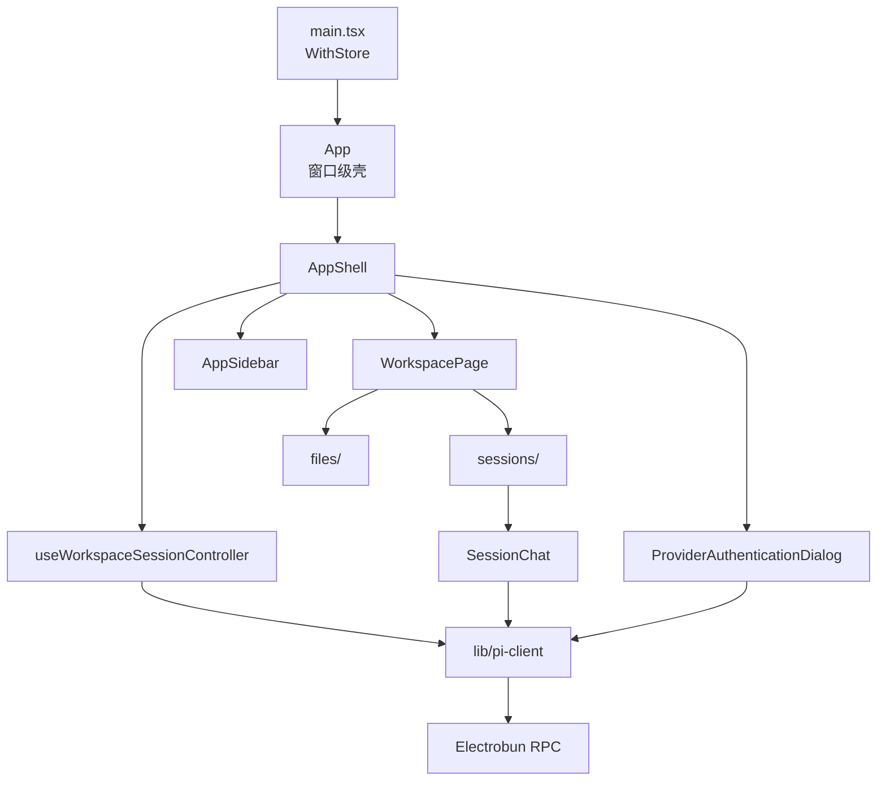
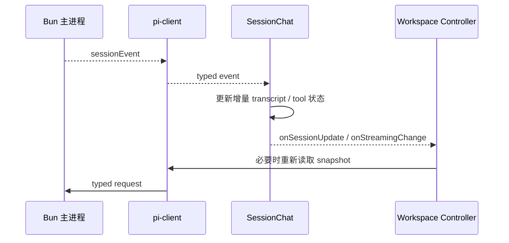

# React Renderer 架构

## 职责

Renderer 负责展示工作区、会话和认证状态，收集用户操作，并把意图发送给 Bun 主进程。它不解释 Pi session 文件、不访问凭据、不执行工具，也不复制 Pi SDK 的业务状态机。



对应局部 owner 文档：

- [`src/mainview/biz/app/ai.prompt.md`](../src/mainview/biz/app/ai.prompt.md)：工作区级 controller 与顶层页面状态。
- [`src/mainview/biz/workspace/sessions/session/ai.prompt.md`](../src/mainview/biz/workspace/sessions/session/ai.prompt.md)：流式会话 UI 与工具授权交互。
- [`src/mainview/atom/ai.prompt.md`](../src/mainview/atom/ai.prompt.md)：Atom 完整 API 与使用方式。

本文维护 Renderer 跨 feature 的组合与依赖方向；单个 owner 的状态机和修改规则由对应局部文档维护。

## 当前源码结构

```text
src/mainview/
├── main.tsx                              # React root、WithStore、主题初始化
├── App.tsx                               # 窗口级视觉壳与 TooltipProvider
├── biz/
│   ├── app/
│   │   ├── AppShell.tsx                  # sidebar、workspace、认证弹窗组合
│   │   ├── use-workspace-session-controller.ts
│   │   ├── preferences/                  # 浏览器侧 UI 偏好
│   │   └── sidebar/                      # 工作区切换与设置入口
│   ├── authentication/                   # provider 列表与登录步骤
│   └── workspace/
│       ├── index.tsx                     # files 与 sessions 区域协调
│       ├── files/                        # 文件树、读取与预览
│       └── sessions/
│           ├── SessionList.tsx
│           └── session/
│               ├── index.tsx             # 当前会话状态机
│               └── chat/                 # transcript、消息、输入、模型与授权
├── components/
│   ├── ui/                               # 跨业务 UI 基元
│   └── markdown-content.tsx              # Markdown 渲染
├── lib/
│   ├── pi-client.ts                      # 唯一 Electrobun client
│   └── theme.ts                          # 主题持久化
├── atom/                                 # 小型共享状态基础设施
└── states/                               # 应用级 atom 定义
```

目录结构表达业务组合关系。`biz/app` 可以组合 workspace 与 authentication；反向依赖禁止。files 和 sessions 是 workspace 下的同级域，不互相导入。

## 组合边界

### 应用壳

`App` 只提供窗口级视觉壳和全局 UI provider。`AppShell` 组合侧栏、工作区页面和认证弹窗，不承载 RPC 流程。

`useWorkspaceSessionController` 是工作区级页面状态 owner，持有：

- 当前工作区 snapshot
- 当前打开的 session snapshot/transcript
- provider 认证摘要
- loading、authentication、network 和页面错误状态
- 最近工作区、主题和思考内容显示偏好

切换工作区、创建/打开 session、认证完成后的资源刷新都从 controller 发起。不要把这些协调逻辑拆散到 sidebar 或展示组件。

### 工作区域

`WorkspacePage` 只协调 session 列表、当前聊天和文件浏览器。`files/` 拥有文件树、选择和预览状态；`sessions/` 拥有会话列表和当前 session 交互。文件域与会话域不直接相互依赖，由 `WorkspacePage` 组合。

`SessionChat` 订阅当前 session 的流式 event 和工具授权 request，维护尚未写回完整 transcript 的增量显示状态，并把 session snapshot 更新回 controller。它不自行打开工作区或读取持久 session。

### 认证

`ProviderAuthenticationDialog` 订阅认证事件，只维护当前弹窗交互步骤和用户输入。provider 列表及登录完成后的全局刷新由 controller 管理。关闭弹窗时取消仍在进行的 provider 登录。

## Workspace 与认证交互

controller 选择 workspace 后以主进程返回的规范路径更新 snapshot，并把路径加入最近工作区；切换到不同 workspace 时清除旧 `openedSession`。创建或继续最近 session 时，同时请求新 session 和最新 workspace snapshot，成功后一起更新页面。

文件区域由 `useWorkspaceFiles` 持有目录、选择和内容加载状态。主进程过滤 `.git`、`node_modules`、`dist`、`build`、`.next`，文件预览最多读取 512 KiB，并显式标记 binary 与 truncated；Renderer 只展示结果，不自行读取本地路径。

认证弹窗直接订阅 authentication event，以 provider 为当前交互身份，展示 auth URL、device code、进度以及 text/secret/manual-code/select prompt。provider 状态和登录后的全局资源刷新仍由 controller 持有；关闭弹窗时取消正在进行的 provider flow。

## RPC 边界

`src/mainview/lib/pi-client.ts` 是 Renderer 唯一 Electrobun 接入点：

- 导出按业务命名的 request 函数。
- 导出 session、authentication 和 tool-permission event 订阅。
- 只使用 `@shared/pi-rpc` 与 `@shared/pi-contract` 类型。
- 不缓存业务状态、不重试、不解释 SDK 错误。

业务组件不得直接导入 `electrobun/view`，也不得导入 `src/bun` 或 Pi SDK。新增 RPC 调用先进入 `pi-client.ts`，再由真正的页面/controller owner 使用。

## 状态策略

默认优先级：

1. 仅组件内部需要：`useState` / `useRef`。
2. 父子组件共同需要：Props 和业务 hook。
3. 页面级协调：由最近的 controller 持有。
4. 真正跨树、跨业务且生命周期属于整个 `WithStore`：才使用 `src/mainview/atom`。

Atom 的具体语义见 [`../src/mainview/atom/ai.prompt.md`](../src/mainview/atom/ai.prompt.md)。不要同时用 React state 和 atom 保存同一业务事实；主进程 snapshot 可重新获取，Renderer 状态只是当前视图副本。

浏览器侧持久化只用于 UI 偏好：主题、是否显示思考过程、最近工作区。Pi 认证、模型、资源与 session 不写入 `localStorage`。

### 模型、Thinking 与输入状态

当前模型、可选模型、thinking level 和可用 thinking levels 都来自 `PiOpenedSession.runtime`。`ModelThinkingSelector` 位于会话 composer 中，修改后以主进程返回的新 `PiOpenedSession` 更新界面；session streaming 或切换请求期间禁止修改。

发送按钮的可用性同时取决于当前模型和对应 provider 的可用凭据。没有可用凭据时显示连接 provider 的操作，而不是发送一个必然失败的 request。显示 thinking 内容只是 Renderer 偏好，不改变 session 的 thinking level。

SessionChat 将完整 transcript 与当前轮临时状态分开：乐观 user message、assistant text/thinking delta、tool 状态和 permission 队列只存在于当前轮。切换 `sessionPath` 时全部清空；`agent_settled` 后重新读取 transcript，不能把拼接中的 UI 状态当成持久 session。

## 事件与一致性



所有 session event 都携带 `sessionPath`。订阅者必须忽略不属于当前打开 session 的事件，避免切换会话后旧流污染新视图。完整刷新以主进程返回的 snapshot/transcript 为准，增量状态不能成为第二份持久事实来源。

事件处理保持原始生命周期差异：`agent_start` 进入 streaming，assistant delta 追加显示，tool start/end 更新同一 `toolCallId`，error 回滚乐观消息并展示错误，`agent_settled` 退出 streaming 并触发完整刷新。`agent_end` 不能替代 settled，因为主进程可能仍在执行认证恢复。

工具 permission request 也按 `sessionPath` 过滤，并在当前会话中排队逐个展示。Renderer 只有在主进程确认 response 成功后才移除请求；真正的 pending resolver、默认拒绝和危险命令判断始终属于 Bun 主进程。

## 依赖方向

- `biz/app` 可以组合 `biz/workspace` 和 `biz/authentication`。
- `biz/workspace/files` 与 `biz/workspace/sessions` 保持同级隔离。
- feature 可以依赖 `components`、`lib`、`atom` 和 shared DTO；基础设施不得反向依赖业务 feature。
- 真正跨业务复用的视觉原语进入 `components/`，传输和浏览器基础设施进入 `lib/`；不要新增含糊的 `biz/shared` 或 `biz/components`。
- 不为目录创建只做 re-export 的 barrel；目录入口本身承担真实组合职责时可以使用 `index.ts(x)`。

## 修改与验证

- controller、事件处理或 session 交互变化：验证工作区切换、会话切换和旧事件隔离。
- 流式 UI 变化：验证 assistant text、thinking、tool start/update/end、error、abort 与 settled 路径。
- 认证 UI 变化：验证 OAuth URL/device code、文本或 select prompt、取消和登录后资源刷新。
- UI 行为使用真实 Renderer 路径检查；类型与构建最终运行 `bun run verify`。桌面 WebView 特有行为不能只由浏览器单元测试证明。

具体交付路径包括：workspace 切换后旧 session 不残留；并行 session 的旧 event 不污染当前视图；prompt、steer、follow-up、abort 保持不同语义；登录后资源与当前 session 重新加载；文件 binary/truncated 状态正确展示；thinking 显示偏好不改变模型运行配置。UI 布局或交互变化使用真实 Renderer 检查，桌面 WebView 特有行为必须在 Electrobun 应用中验证。
