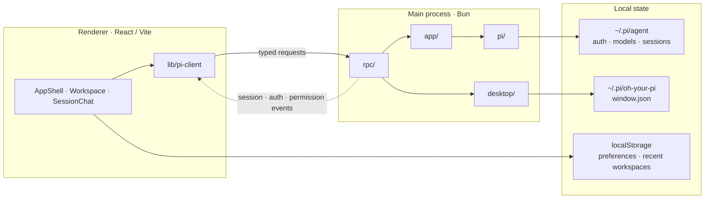

# Oh Your Pi 架构

## 定位

Oh Your Pi 是基于 **Electrobun + Bun + React/Vite** 的 Pi Coding Agent 桌面客户端。

- Renderer 负责界面、交互和浏览器侧偏好。
- Bun 主进程负责桌面能力、业务用例、Pi SDK、文件系统和凭据访问。
- 两端只通过 Electrobun RPC 交换受 TypeScript 类型约束的数据。

## 文档分工

- 本文：系统边界、依赖方向和全局不变量。
- [`arch-main.md`](./arch-main.md)：Bun 主进程、Pi runtime、业务层、RPC 和桌面生命周期。
- [`arch-render.md`](./arch-render.md)：React Renderer、页面组合、状态和事件处理。

## 系统拓扑



## 源码边界

```text
src/
├── bun/          # Bun 主进程
├── mainview/     # React Renderer
└── shared/       # 跨进程 TypeScript DTO 与 RPC schema
```

依赖方向：

```text
mainview ──→ shared ←── bun/rpc ←── bun/app ←── bun/pi
                                 ↘
                                  bun/desktop
```

约束：

1. Renderer 不导入 `src/bun` 或 `@earendil-works/pi-*`。
2. `src/bun/pi/**` 是主进程内唯一允许导入 `@earendil-works/pi-*` 的区域。
3. `src/bun/pi/**` 不依赖 App、RPC DTO、Electrobun 或 Renderer。
4. `src/bun/app/**` 不依赖 Electrobun；桌面和传输能力由外层适配。
5. `src/bun/rpc/**` 只转发请求与事件，不实现业务状态机。
6. `src/shared/**` 只包含静态 TypeScript 契约，不执行运行时解析。

## 跨进程契约

- `src/shared/pi-contract.ts`：workspace、session、模型、认证、权限、文件、诊断和事件 DTO。
- `src/shared/pi-rpc.ts`：Electrobun 请求、响应和主进程推送消息的静态 schema。
- `src/bun/rpc/index.ts`：主进程 RPC 适配器。
- `src/mainview/lib/pi-client.ts`：Renderer 唯一 Electrobun RPC 客户端。

RPC 类型由 TypeScript 和 Electrobun schema 约束，不叠加 Zod 或重复的 `.parse()` 包装。

## 身份与状态

- workspace 使用规范化绝对路径标识。
- live session 使用持久化 `sessionPath` 标识。
- `PiRuntime` 在主进程生命周期内只创建一个 `ModelRuntime`。
- 多个 live session 各自持有独立 `AgentSession`，由 session registry 直接索引。
- Renderer 不持有凭据，只保存服务端返回的安全 DTO 和界面临时状态。

## 持久化

- Pi SDK 数据：`~/.pi/agent`，包括认证、模型配置和 JSONL session。
- 应用窗口状态：`~/.pi/oh-your-pi/window.json`。
- Renderer 偏好：当前 WebView origin 的 `localStorage`。

凭据、token、API key 和完整 `auth.json` 不进入 Renderer；跨进程诊断和工具参数在主进程完成脱敏。

## 工程约束

- TypeScript strict mode。
- 路径别名：`@main/*`、`@shared/*`、`@view/*`。
- 目录入口使用无 `/index` 后缀的 import；Electrobun alias resolver 负责解析目录中的入口文件。
- 测试与所属模块共置。
- 完整验证命令：`bun run verify`，依次执行 typecheck、测试和 Vite/Electrobun 构建。
