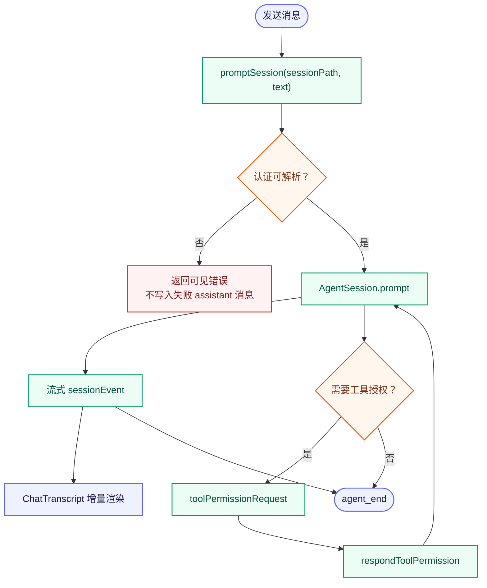
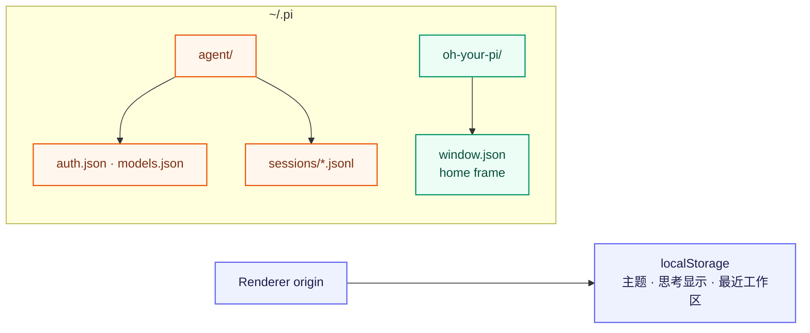

# Oh Your Pi 架构

## 定位

基于 **Electrobun + Bun + React/Vite** 的 Pi Coding Agent 桌面客户端。渲染进程只负责界面与交互；Bun 主进程持有 Pi SDK、工作区、会话和凭据访问权；两端只通过受类型约束的 Electrobun RPC 通信。

```mermaid
flowchart LR
  subgraph View["Renderer · React / Vite"]
    UI["AppShell / Workspace"] --> Client["pi-client"]
  end
  subgraph Main["Main process · Bun"]
    RPC["Electrobun RPC"] --> Service["PiWorkspaceService"] --> Hosts["PiWorkspaceHost\nPiSessionHost × N"]
  end
  subgraph Runtime["Pi runtime"]
    SDK["Pi Coding Agent SDK"] --> Agent["~/.pi/agent\nauth · models · sessions"]
  end
  Client -->|"typed request"| RPC
  RPC -. "session · auth · permission events" .-> Client
  Hosts --> SDK

  classDef view fill:#EEF2FF,stroke:#6366F1,color:#1E1B4B,stroke-width:1.5px;
  classDef bridge fill:#ECFEFF,stroke:#0891B2,color:#164E63,stroke-width:1.5px;
  classDef core fill:#ECFDF5,stroke:#059669,color:#064E3B,stroke-width:1.5px;
  classDef runtime fill:#FFF7ED,stroke:#EA580C,color:#7C2D12,stroke-width:1.5px;
  class UI,Client view;
  class RPC bridge;
  class Service,Hosts core;
  class SDK,Agent runtime;
```



## 主进程：Pi 运行边界

- `src/bun/index.ts`：创建主窗口、RPC 与 `PiWorkspaceService`；启动前调用 `registerBunOAuthFlows()`。Pi 的 OAuth loader 含 bundler 不透明动态导入，必须静态注册，否则打包后的 Bun 主进程无法可靠加载 GitHub Copilot OAuth。
- `src/bun/workspace/service.ts`：唯一的 Pi 业务入口。按显式 `workspacePath` / `sessionPath` 路由请求，不保存“当前活动会话”；负责会话创建、打开、模型与思考级别、prompt、认证、权限、诊断与资源刷新。
- `src/bun/pi/runtime.ts`：`PiWorkspaceHost` 缓存一个工作区的多个活动 `PiSessionHost`；每个 host 独占一个 `AgentSession` 及其 SDK services，可独立重建和释放。并行会话依靠多个 `AgentSession`，不是前端虚拟状态。
- `src/bun/workspace/events.ts` 与 `permissions.ts`：将 SDK 流式事件和工具授权请求转发给 Renderer，避免 UI 直接接触 SDK。
- `src/bun/workspace/auth.ts`：处理 OAuth / API key 登录、device code、交互式提示与取消；同一 provider 的认证及 prompt 操作串行化。
- `src/bun/pi/diagnostics.ts`、`redaction.ts`：只记录认证状态、文件元信息和环境摘要，绝不输出 token、API key 或完整 `auth.json`。

### OAuth 可靠性

GitHub Copilot OAuth 曾只在打包 GUI 中失败，根因是未注册 Bun 静态 OAuth flow，现已通过 `registerBunOAuthFlows()` 修复。发送前会解析当前模型认证；若运行中出现明确 OAuth 解析失败，服务记录脱敏诊断、回退到失败 assistant 消息的父节点、重新解析认证后仅恢复一次 `agent.continue()`。不对通用模型、限流或工具错误重试。

## RPC 与共享契约

- `src/shared/pi-contract.ts`：Zod schema 是跨进程数据的唯一真相，覆盖工作区快照、会话、模型、事件、认证、权限、文件和诊断。
- `src/shared/pi-rpc.ts`：声明请求/响应及主进程推送消息。
- `src/bun/rpc/pi-rpc.ts`：主进程 handler 与事件桥接。
- `src/mainview/lib/pi-client.ts`：Renderer 唯一 RPC 客户端。业务组件不得直接使用 Electrobun 或 Pi SDK。

新增 RPC 时必须先扩展 `pi-contract.ts` 和 `pi-rpc.ts`，在主进程解析输入，再由 `pi-client.ts` 暴露给界面。

### 一次消息的路径



## 渲染进程：按业务域组织

```text
src/mainview/
├── App.tsx                         # 窗口级壳与 TooltipProvider
├── biz/
│   ├── app/                        # 全局工作区/会话控制、偏好、侧栏
│   │   ├── AppShell.tsx
│   │   ├── use-workspace-session-controller.ts
│   │   ├── preferences/
│   │   └── sidebar/
│   ├── authentication/             # provider 登录对话框及流程 UI
│   └── workspace/                  # 已选工作区的布局与局部 pane 协调
│       ├── files/                  # 文件读取、树与预览
│       └── sessions/
│           ├── SessionList.tsx
│           └── session/
│               └── chat/           # 流式聊天、消息、输入、权限、模型/思考选择
├── components/                     # 跨业务的 UI 基元与 Markdown 渲染
├── lib/                            # RPC 客户端、主题等基础设施
└── states/                         # 跨页面 atom 状态
```

- `AppShell` 组合侧栏、工作区与认证弹窗；`use-workspace-session-controller` 持有工作区选择、会话打开/新建、网络状态及偏好持久化。
- `workspace/index.tsx` 仅协调会话列表、会话 pane、文件树和文件预览；文件域与会话域互不依赖。
- `sessions/session/index.tsx` 订阅流式事件、处理发送/中止/跟进/steer 与工具授权；`chat/` 下的 transcript、消息类型、composer、header 和模型/思考选择器分担展示与交互。
- 模型与思考级别由 `ModelThinkingSelector.tsx` 独立呈现，位于发送按钮左侧；流式输出或切换请求期间禁用。

约束：`app` 可依赖 `workspace`，反向依赖禁止；只有 controller、hook 或会话事件层调用 `pi-client`；不新增 `biz/components`、`biz/shared`、barrel 文件。真实跨域复用再提升至 `mainview/components` 或 `mainview/lib`。

## 数据与持久化

- Pi 原生数据继续由 SDK 管理于 `~/.pi/agent`：认证、模型配置和 JSONL session；GUI 与 Pi TUI 共享它们。
- 应用自有数据放在 Pi 根目录下：`~/.pi/oh-your-pi/window.json`。其中 `home` 保存 `{ x, y, width, height }`；首次创建窗口即写入，移动/缩放经 150 ms 防抖原子写回，非法或缺失状态回退默认窗口尺寸。
- Renderer 偏好（深色模式、显示思考过程、最近工作区）存于 `localStorage`，对应 `biz/app/preferences/` 的纯函数。
- 凭据不进入 Renderer；认证 URL 可由主进程打开，device code 与进度仅作为受控事件展示。



## 工程约束与验证

- TypeScript 严格模式；路径别名：`@main/*`、`@shared/*`、`@view/*`。
- 测试与纯函数/服务共置；`bun test` 覆盖 RPC、workspace、Pi 诊断与 UI 单元行为。
- 交付验证：`bun run verify` 依次执行 typecheck、测试和 Vite/Electrobun 构建。涉及真实 provider 的改动还必须从桌面 Renderer 经 RPC 实测，构建通过不能替代该路径。
