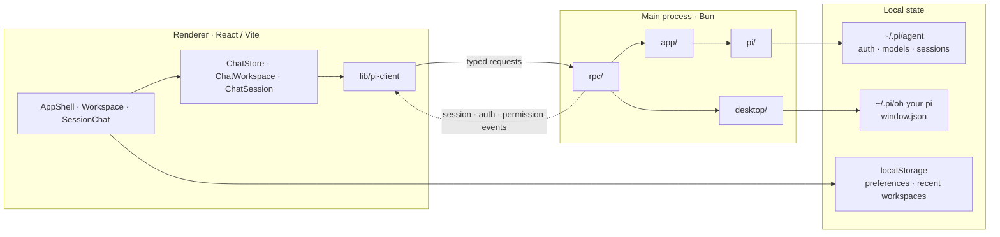
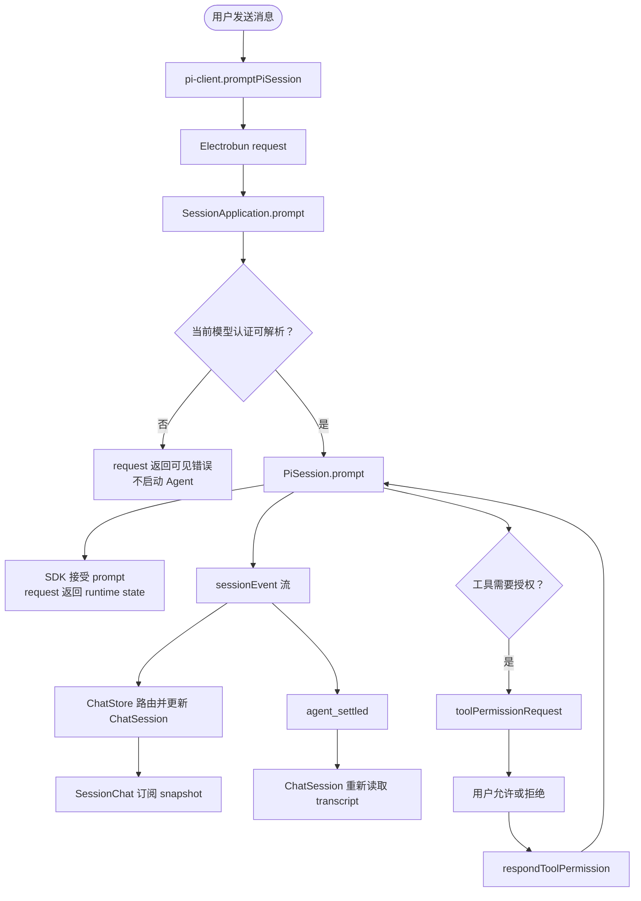
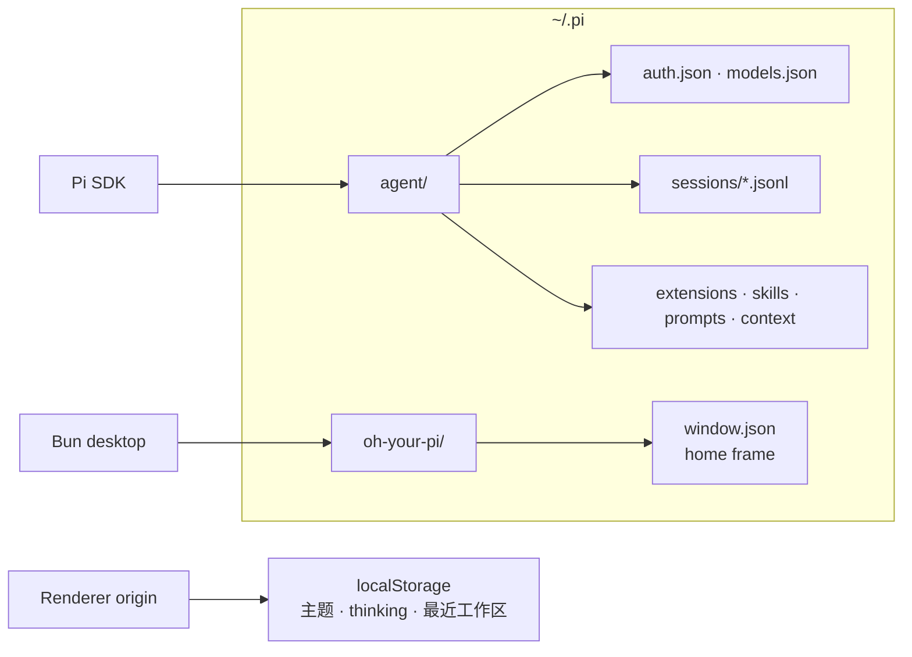

# Oh Your Pi 架构

## 定位

Oh Your Pi 是基于 **Electrobun + Bun + React/Vite** 的 Pi Coding Agent 桌面客户端，组合 Pi 的能力，不实现第二套 Agent。

- Renderer 负责界面、交互和浏览器侧偏好。
- Bun 主进程负责桌面能力、业务用例、Pi SDK、文件系统和凭据访问。
- 两端只通过 Electrobun RPC 交换受 TypeScript 类型约束的数据。

## 文档分工

- 本文：系统边界、依赖方向和全局不变量。
- [`arch-main.md`](./arch-main.md)：Bun 主进程、Pi runtime、业务层、RPC 和桌面生命周期。
- [`arch-render.md`](./arch-render.md)：React Renderer、页面组合、状态和事件处理。

局部实现文档按 owner 就近维护：

| 范围 | 局部文档 | 负责内容 |
|---|---|---|
| 跨进程 DTO 与 RPC schema | [`src/shared/ai.prompt.md`](../src/shared/ai.prompt.md) | 线协议、身份和契约演进 |
| Pi SDK 运行边界 | [`src/bun/pi/ai.prompt.md`](../src/bun/pi/ai.prompt.md) | runtime、workspace、live session 与 SDK 生命周期 |
| Bun 应用用例层 | [`src/bun/app/ai.prompt.md`](../src/bun/app/ai.prompt.md) | 用例组合、DTO 映射和交互状态 |
| Session Application | [`src/bun/app/session/ai.prompt.md`](../src/bun/app/session/ai.prompt.md) | event、工具授权和认证恢复 |
| Renderer 应用控制器 | [`src/mainview/biz/app/ai.prompt.md`](../src/mainview/biz/app/ai.prompt.md) | workspace/session 页面级状态 |
| Session 会话界面 | [`src/mainview/biz/workspace/sessions/session/ai.prompt.md`](../src/mainview/biz/workspace/sessions/session/ai.prompt.md) | 流式 UI、输入语义和 permission 交互 |
| Atom 基础设施 | [`src/mainview/atom/ai.prompt.md`](../src/mainview/atom/ai.prompt.md) | Atom 完整 API 与使用方式 |

全局文档只维护跨模块事实；实现细节进入上表对应 owner。阅读时先从本文确定系统边界，再按任务进入进程文档和局部文档。

## 系统拓扑



## 源码边界

```text
src/
├── bun/          # Bun 主进程
├── mainview/     # React Renderer
└── shared/       # 跨进程 TypeScript DTO 与 RPC schema
```

依赖方向：

```text
mainview ──→ shared ←── rpc ──→ app ──→ pi ──→ Pi SDK
                         └──→ desktop ──→ Electrobun / OS
```

约束：

1. Renderer 不得运行时导入 `src/bun` 或 `@earendil-works/pi-*`；`import type` 可以复用 SDK 已有事实类型。
2. `src/shared/**` 可以 type-only 导入 Pi SDK，并优先直接复用或用 `Pick` / `Omit` / `Extract` 派生 RPC 安全子集；不得复制同构类型。
3. `src/bun/pi/**` 是主进程内唯一允许运行时导入 `@earendil-works/pi-*` 的区域；可以 type-only 依赖共享契约作为输出约束。
4. `src/bun/app/**` 不依赖 Electrobun；桌面和传输能力由外层适配。
5. `src/bun/rpc/**` 只转发请求与事件，不实现业务状态机。
6. `src/shared/**` 只包含静态 TypeScript 契约，不执行运行时解析。

## 跨进程契约

- `src/shared/pi-contract.ts`：workspace、session、模型、认证、权限、文件、诊断和事件 DTO。
- `src/shared/pi-rpc.ts`：Electrobun 请求、响应和主进程推送消息的静态 schema。
- `src/bun/rpc/index.ts`：主进程 RPC 适配器。
- `src/mainview/lib/pi-client.ts`：Renderer 唯一 Electrobun RPC 客户端。

RPC 类型由 TypeScript 和 Electrobun schema 约束，不叠加 Zod 或重复的 `.parse()` 包装。

## 一次消息的端到端路径



消息 request 只确认主进程与 SDK 已接受命令，不等待整轮生成。文本、thinking、工具状态和错误由带 `sessionPath` 的 event 流传递；Renderer 的唯一全局 ChatStore 把事件路由到所属后台 session，当前导航选择不参与路由。`agent_settled` 后由对应 `ChatSession` 刷新 transcript，并按 generation 清理临时增量。

工具授权是独立的主进程发起交互：危险等级用于 UI 提示，最终决定仍由用户返回。认证解析失败只在主进程受控恢复一次，不由 Renderer 重发 prompt。

## 身份与状态

- workspace 使用规范化绝对路径标识。
- live session 使用持久化 `sessionPath` 标识。
- `PiRuntime` 在主进程生命周期内只创建一个 `ModelRuntime`。
- 多个 live session 各自持有独立 `AgentSession`，由 session registry 直接索引。
- Renderer 不持有凭据，只保存服务端返回的安全 DTO 和界面临时状态。

## 持久化

- Pi SDK 数据：`~/.pi/agent`，包括认证、模型配置和 JSONL session。
- 应用窗口状态：`~/.pi/oh-your-pi/window.json`。
- Renderer 偏好：当前 WebView origin 的 `localStorage`。

凭据、token、API key 和完整 `auth.json` 不进入 Renderer；跨进程资源诊断与工具授权摘要在主进程脱敏。session transcript 本身保留 Pi 已持久化的 tool-call arguments，不额外生成一份 Renderer 专用工具数据。

### 具体持久化行为

- `~/.pi/agent` 完全由 Pi SDK 管理，GUI 与 Pi TUI 共享认证、模型配置、资源和 JSONL session；应用不复制或迁移这些数据。
- `~/.pi/oh-your-pi/window.json` 只保存主窗口 `{ x, y, w, h }`。窗口创建时立即落盘，移动和缩放以 150 ms 合并写入，关闭时同步 flush；文件通过同目录临时文件加 rename 原子替换，目录和文件权限分别为 `0700` 与 `0600`。
- 窗口状态缺失、损坏或尺寸非法时回退到默认 frame，不让持久化错误阻止应用启动。
- Renderer 的主题、是否显示 thinking 和最近工作区保存到当前 WebView origin 的 `localStorage`；workspace snapshot、打开会话和认证状态不持久化在浏览器。



## 工程约束

- TypeScript strict mode。
- 路径别名：`@main/*`、`@shared/*`、`@view/*`。
- 目录入口使用无 `/index` 后缀的 import；Electrobun alias resolver 负责解析目录中的入口文件。
- 测试与所属模块共置。
- 完整验证命令：`bun run verify`，依次执行 typecheck、测试和 Vite/Electrobun 构建。

验证必须匹配改动层级：纯 DTO 变化至少覆盖 typecheck 和两端适配；会话、认证、权限与文件行为运行对应共置测试；最终使用 `bun run verify` 执行 typecheck、测试、Vite 构建和 Electrobun 构建。真实 provider、OAuth、系统对话框、窗口 reopen/quit 与桌面 WebView 行为必须从打包桌面路径验证，构建成功不能替代该路径。
