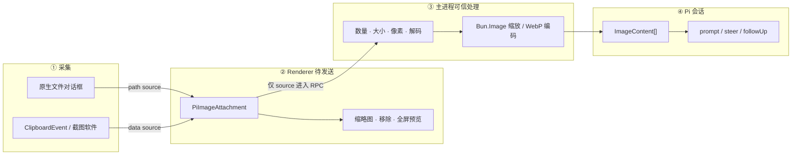
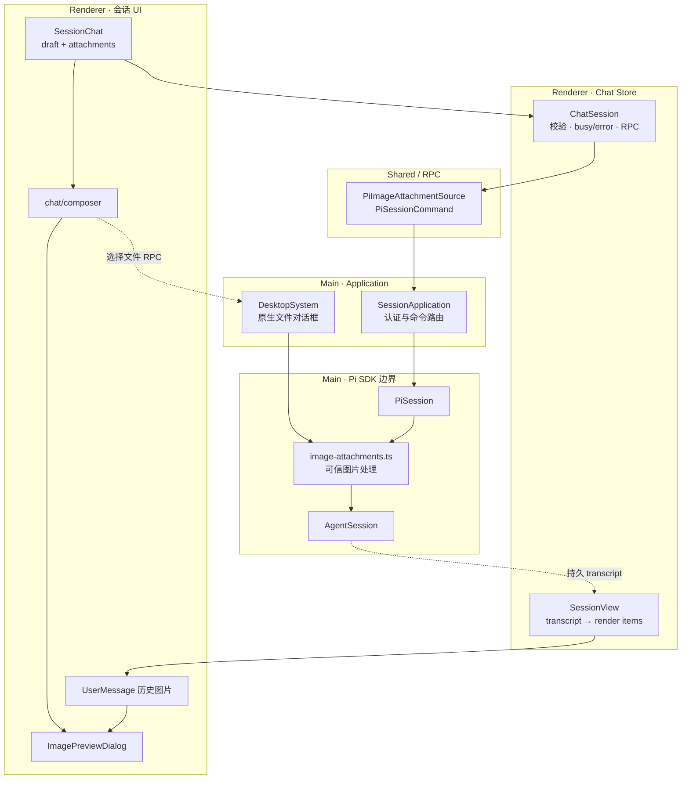
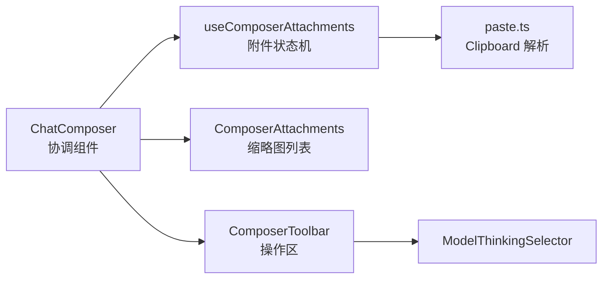
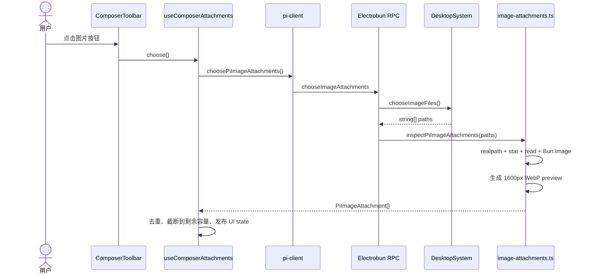
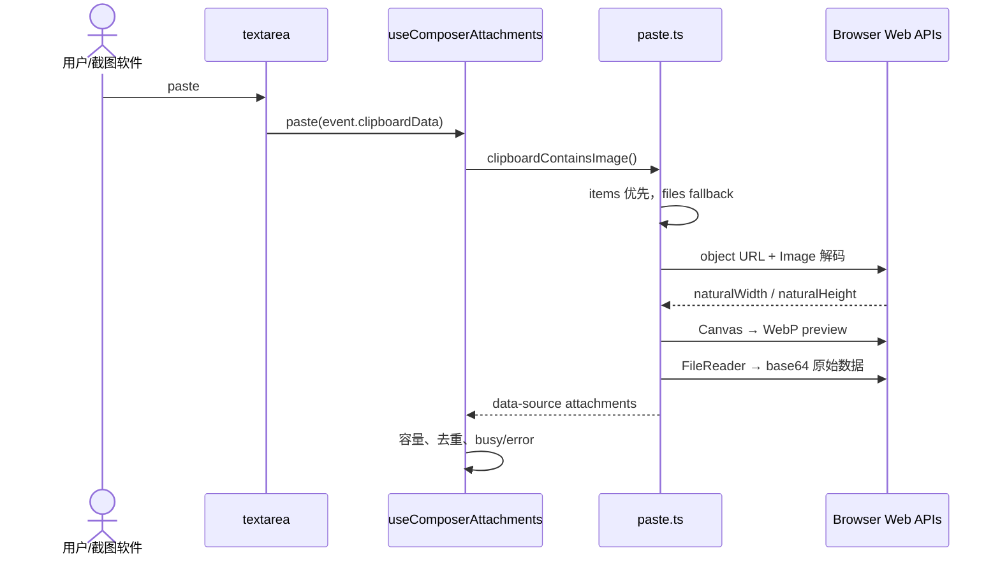
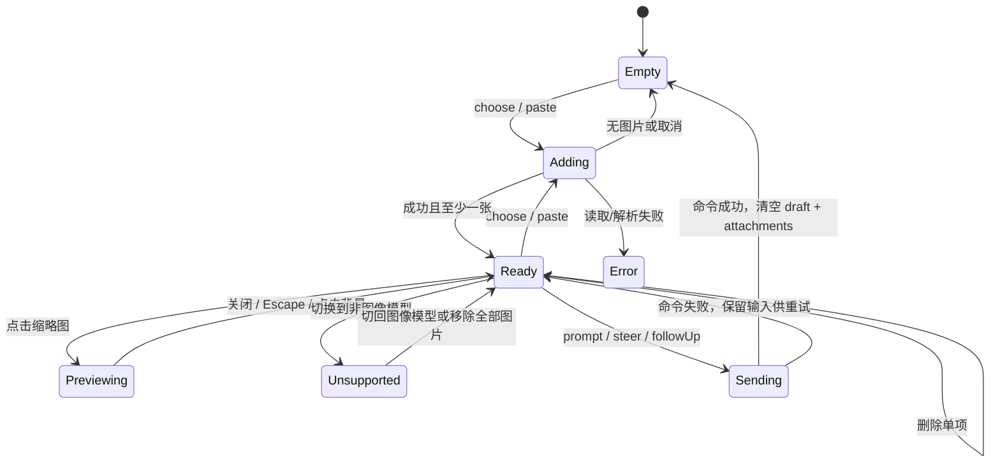
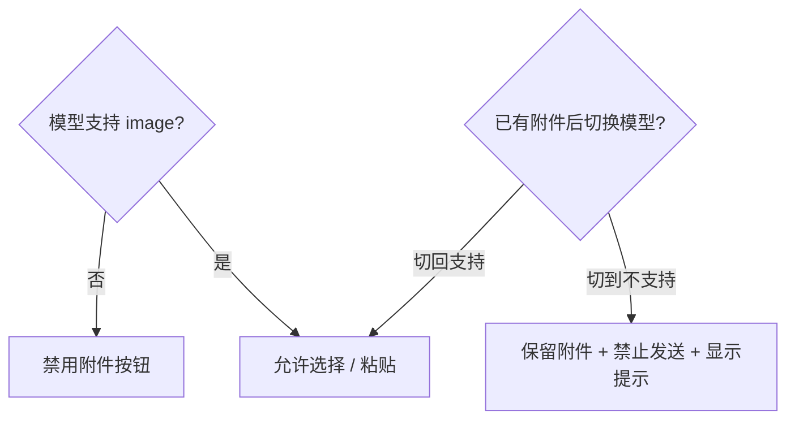
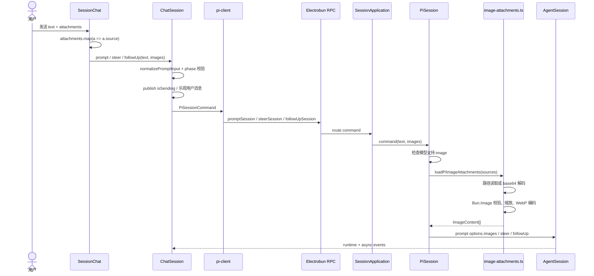
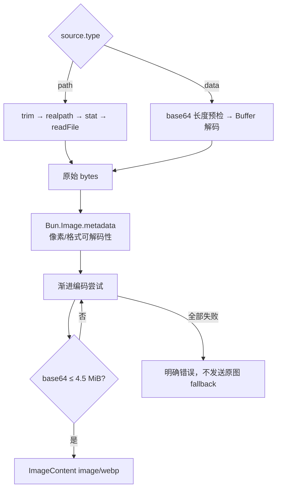

# 图片附件与 Chat Composer 技术方案报告

> 本报告覆盖本轮实现的完整方案：Composer 模块化、原生文件选择、剪贴板/截图二进制粘贴、待发送附件状态、全屏预览、Renderer 与主进程信任边界、Bun 图片处理、Pi 消息发送以及历史图片回显。

## 1. 一页结论

这套方案的核心不是“给按钮绑一个 `<input type=file>`”，而是把图片附件拆成了三个阶段：

1. **采集阶段**：原生文件得到路径；剪贴板截图得到内存二进制。
2. **待发送阶段**：Renderer 统一保存为 `PiImageAttachment`，负责缩略图、移除、预览和发送前状态。
3. **可信发送阶段**：主进程只接收 `PiImageAttachmentSource`，重新读取或解码、校验、缩放、压缩，再构造 Pi SDK 的 `ImageContent`。



最关键的设计决策：**路径和内存数据不是互斥方案，而是统一 source 的两种形态。**

---

## 2. 为什么需要两种图片来源

### 2.1 原生文件选择适合已有文件

通过主进程 `Utils.openFileDialog()` 选择图片，可以直接得到真实路径：

- 不需要把原始文件先搬进 Renderer；
- 发送时主进程可以重新读取最新内容；
- 可以执行 `realpath`、`stat`、文件类型与大小检查；
- 后续若要增加文件定位、重新打开或路径审计，有明确的扩展基础。

### 2.2 剪贴板截图天然可能没有路径

截图软件通常把 PNG 等二进制直接写入系统剪贴板。WebView 的 paste 事件拿到的是 `DataTransferItem → File/Blob`，这个对象可能从未落盘，因此不存在可以传给主进程的文件路径。

如果强行要求路径，只能额外创建临时文件，引入清理、权限、命名冲突和生命周期问题。当前方案直接把原始二进制编码为 base64 data source，避免临时文件。

### 2.3 统一领域模型

```ts
type PiImageAttachmentSource =
  | { type: "path"; path: string }
  | { type: "data"; data: string; mimeType: string; name: string };

type PiImageAttachment = {
  id: string;
  source: PiImageAttachmentSource;
  name: string;
  previewDataUrl: string;
  width: number;
  height: number;
};
```

两种类型解决不同问题：

| 类型 | 生命周期 | 责任 |
|---|---|---|
| `PiImageAttachmentSource` | 进入 RPC 和主进程 | 表达“主进程从哪里获得原始图片” |
| `PiImageAttachment` | 仅待发送 UI | 在 source 之外附加 ID、名称、缩略图和展示尺寸 |
| Pi SDK `ImageContent` | 最终模型输入 | 主进程重新处理后产生的 `{ type, data, mimeType }` |

`previewDataUrl` 永远不会被当成最终模型输入。它只服务 UI。

---

## 3. 总体分层与职责



### 3.1 为什么待发送附件不放入 Chat Store

附件和 draft 一样，是尚未提交的界面输入：

- 它们归属于当前挂载的 `SessionChat`；
- 发送成功后清空；
- 发送失败时保留，方便用户直接重试；
- 剪贴板 data source 可能包含大块 base64，不应进入会长期保活、自动淘汰的 Chat Store session cache。

Chat Store 接手的时刻是用户真正触发 `prompt / steer / followUp`。

---

## 4. Composer 模块设计

目录：`src/mainview/biz/workspace/sessions/session/chat/composer/`



| 文件 | 主要职责 |
|---|---|
| `ChatComposer.tsx` | 组合输入区、附件区、工具栏；计算 `canCompose`、`canSend`；接收 paste 事件 |
| `ComposerAttachments.tsx` | 缩略图、单项移除、打开全屏预览 |
| `ComposerToolbar.tsx` | 添加图片、模型、thinking、认证入口、follow-up 和发送 |
| `use-composer-attachments.ts` | 原生选择与粘贴的合并、去重、容量、busy/error、预览索引 |
| `paste.ts` | 把 `DataTransfer` 中的无路径图片转换成 `PiImageAttachment` |
| `ModelThinkingSelector.tsx` | 过滤可用模型，切换模型/thinking，展示模型图像能力 |
| `index.ts` | 模块公共出口 |

`ChatComposer` 只协调，不直接知道 RPC、文件系统或 Bun 图片处理细节。这是后续继续增加拖拽、录屏帧、附件排序等能力时的扩展边界。

---

## 5. 两条采集链路

### 5.1 原生文件选择链路



文件对话框允许多选，并限制到 jpg/jpeg/png/webp/gif/bmp/tif/tiff/heic/heif/avif。

主进程返回的 path source 已经过 `realpath`。预览也在主进程生成，所以 Renderer 不需要自行读取本机路径。

### 5.2 剪贴板与截图链路



这里有几个刻意选择：

- **不调用 RPC**：选中后即可由 Renderer 自己预览。
- **不创建临时文件**：截图数据无需伪造路径。
- **不阻止默认 paste**：普通文本粘贴仍由浏览器处理；如果 clipboard 同时带文本和图片，图片解析是附加行为。
- **items 优先、files fallback**：兼容不同 WebView/剪贴板实现。
- **拒绝 SVG**：附件路径只接受栅格图片，避免把可执行/可引用外部资源的 SVG 当作截图处理。
- **按剩余容量读取**：不会因为一次粘贴包含大量文件就无界解码。

无文件名的 Blob 会获得 `剪贴板图片 N.<ext>` 名称。

---

## 6. 待发送附件状态机



### 6.1 合并与去重

- path source 使用规范化路径作为 identity；同一路径不会重复加入。
- data source 使用 attachment ID 区分。
- 不对 base64 做内容哈希：对大图片额外扫描和分配不划算，而且剪贴板中的两次粘贴可被视为两个明确用户动作。

### 6.2 并发保护

`isAdding = isChoosing || isPasting`：

- 添加过程中按钮显示 loading；
- 禁止选择和粘贴并发覆盖附件数组；
- 删除会重置预览索引和局部错误。

---

## 7. 模型能力与发送语义

当前模型的 `input.includes("image")` 是 UI 是否允许添加图片的能力开关。



发送条件：

- 有可用认证；
- 有可用模型；
- 文本非空或至少一张附件；
- 不存在当前模型无法处理的附件；
- 当前没有发送请求在途。

会话阶段保持 Pi 原生语义：

| 会话状态/操作 | 调用 |
|---|---|
| idle 普通发送 | `session.prompt(text, images)` |
| streaming 普通发送 | `session.steer(text, images)` |
| streaming “排队后续” | `session.followUp(text, images)` |

纯图片消息合法。`normalizePromptInput()` 只在“文本为空且图片数组也为空”时拒绝。

---

## 8. 发送端到端链路



只有 `prompt` 会额外经过 provider 认证解析与恢复窗口；`steer`、`followUp` 作用于已经运行的 live session。

---

## 9. 主进程可信图片管线

主进程的 `src/bun/pi/session/image-attachments.ts` 是最终图片事实的唯一 owner。



### 9.1 防线

| 层级 | 限制/校验 |
|---|---|
| Renderer 采集 | 最多 8 张、单源 64 MiB、1 亿像素、拒绝 SVG |
| Chat Store 命令 | 非空消息、最多 8 张、source 结构、路径去重 |
| Main source 校验 | 再次检查数量、路径/data 结构、base64 编码长度 |
| Main 文件读取 | `realpath`、`stat.isFile()`、stat 与读取后双重 64 MiB 检查 |
| Main 解码 | `Bun.Image` 最多 1 亿像素，拒绝无法解析的图片 |
| Main provider payload | 最终 base64 约 4.5 MiB 上限 |

### 9.2 渐进压缩策略

按顺序尝试：

| 最大尺寸 | WebP quality |
|---:|---:|
| 2000 | 85 |
| 2000 | 70 |
| 1600 | 80 |
| 1600 | 65 |
| 1280 | 75 |
| 1024 | 70 |

每张图片按顺序处理，避免多张大图同时解码造成峰值内存叠加。如果所有编码都无法进入 inline payload 上限，明确失败，不把未经限制的原图作为 fallback。

### 9.3 为什么 Renderer 仍然要做初步限制

Renderer 限制用于体验与资源保护；主进程限制才是信任边界。RPC 调用者理论上可以绕过 UI，因此主进程不能因为 Renderer 已检查就跳过任何校验。

### 9.4 Electrobun 桌面 Bun 版本是显式运行前置条件

图片管线依赖 `Bun.Image`。本地 `bun test` 使用的是工作站 Bun，而 Electrobun 会用自己携带的 Bun 打包并运行主进程；两者不是同一个二进制。

实际复现结果：

| 运行时 | `Bun.version` | `typeof Bun.Image` |
|---|---:|---|
| Electrobun 1.18.1 默认内置 Bun | 1.3.13 | `undefined` |
| 项目要求的桌面 Bun | 1.3.14 | `function` |

因此方案增加两层保护：

1. `electrobun.config.ts` 显式设置 `build.bunVersion: "1.3.14"`，让 dev/build 下载并使用支持 `Bun.Image` 的桌面运行时。
2. 主进程在初始化 Pi 之前调用 `assertPiRuntimeCapabilities()`；如果未来配置回退或运行时不匹配，会在启动阶段给出明确错误，而不是等用户选图后才出现 `undefined is not a constructor`。

运行时兼容验证不能只执行普通 `bun test`；还要用 Electrobun 下载到 `.electrobun-cache` 的实际 Bun 二进制运行图片管线 smoke test。

---

## 10. 预览与历史消息闭环

### 10.1 待发送预览

Composer 上方显示横向缩略图列表，每张图片有：

- 打开预览；
- 独立移除；
- 可访问名称。

### 10.2 全屏查看器

`ImagePreviewDialog` 不是普通居中 modal，而是 viewport 级黑色封屏查看器：

- 图片等比例 contain；
- 上一张/下一张；
- 左右方向键；
- Escape 与右上角关闭；
- 点击黑色背景关闭；
- 顶部计数、底部文件名。

### 10.3 发送后的历史回显

Pi SDK 将图片保存在 user message 的 `content` 中。刷新 transcript 后：

1. `SessionView.readUserParts()` 把 text 与 `ImageContent[]` 分开；
2. `UserMessage` 用 `data:${mimeType};base64,...` 构造图片 URL；
3. 历史缩略图复用 `ImagePreviewDialog`。

因此附件不是“只在发送前能看见”的临时 UI；它进入 Pi transcript 后可以完整回显。

---

## 11. 错误与恢复策略

| 场景 | 行为 |
|---|---|
| 文件对话框取消 | 不修改附件 |
| clipboard 没有图片 | 不修改附件，普通文本继续粘贴 |
| 图片超过剩余容量 | 只处理能容纳的数量，并显示 8 张上限错误 |
| 预览解码失败 | 显示粘贴错误，不加入损坏附件 |
| 当前模型不支持图片 | 禁止添加；已有附件则保留但禁止发送 |
| 主进程重新解码失败 | 命令失败，ChatSession 发布错误 |
| 发送失败 | draft 与附件保留，可修正或重试 |
| 发送成功 | draft 与附件一起清空 |

这种策略避免“UI 看起来发送成功，但主进程静默丢弃图片”。

---

## 12. 测试与已验证行为

### 自动化测试覆盖

- `pi/runtime.test.ts`
  - 缺少 `Bun.Image` 时 fail-fast；
  - 支持图片 API 的运行时正常通过。
- `composer/paste.test.ts`
  - clipboard binary item 优先；
  - `files` fallback；
  - 文本、SVG 与空 item 过滤。
- `chat-store/utils.test.ts`
  - 纯图片消息；
  - 非 image MIME 拒绝。
- `pi/session/image-attachments.test.ts`
  - 路径源预览与发送编码；
  - 无路径 data source 编码；
  - 8 张上限。
- `pi/session/session.test.ts`
  - `ImageContent[]` 实际传入 SDK prompt options；
  - prompt acceptance/rejection 语义。
- `session-view.test.ts`
  - 历史 user message 保留图片内容。
- `SessionChat.test.tsx`
  - 图像模型附件入口；
  - 非图像模型禁用附件入口。

### 实际交互验证

已使用真实 `ClipboardEvent + DataTransfer + File` 构造无系统路径截图数据并粘贴到 textarea，观察到：

- Composer 生成图片缩略图与移除按钮；
- source 类型为 `data`；
- 原始尺寸与 base64 被正确保留；
- 全屏查看器覆盖完整 viewport；
- 左右方向键可以切换图片。

当前完整验证结果：

```text
45 pass
0 fail
TypeScript diagnostics: 0
Vite build: passed
Electrobun build: passed
```

构建仍有项目原有的单 chunk 超过 500 kB 警告；它不属于附件链路行为错误。

---

## 13. 推荐 Review 顺序

为了最快建立完整心智模型，建议按以下顺序阅读：

1. `src/shared/pi-contract.ts`
   - 先理解 `PiImageAttachmentSource`、`PiImageAttachment`、`PiSessionCommand`。
2. `chat/composer/ai.prompt.md`
   - 看局部所有权和不变量。
3. `chat/composer/ChatComposer.tsx`
   - 看 UI 如何协调附件状态和发送条件。
4. `chat/composer/use-composer-attachments.ts`
   - 看选择、粘贴、去重、上限和错误。
5. `chat/composer/paste.ts`
   - 看无路径图片如何从 Clipboard 变成 data source。
6. `session/index.tsx` 与 `chat-store/session.ts`
   - 看附件 source 如何进入 prompt/steer/follow-up。
7. `src/bun/app/session/index.ts`
   - 看 Application 如何保持命令语义。
8. `src/bun/pi/session/image-attachments.ts`
   - 重点审查信任边界、资源限制和压缩策略。
9. `src/bun/pi/session/session.ts`
   - 看最终 `ImageContent[]` 如何进入 Pi SDK。
10. `session-view.ts`、`messages/UserMessage.tsx`、`ImagePreviewDialog.tsx`
    - 看发送后历史回显与全屏预览闭环。
11. 最后阅读附件相关测试，核对上述不变量是否真正被保护。

---

## 14. 当前刻意没有做的事情

以下不属于当前实现，Review 时不应误认为遗漏调用：

- 不轮询系统剪贴板；只响应 textarea 的 paste 事件。
- 不为剪贴板图片创建临时文件。
- 不从 HTML 中抓取远程 ``，避免隐式网络请求与隐私泄漏。
- 不接受 SVG 作为截图附件。
- 不在 Renderer 做最终 provider payload 压缩。
- 不把未发送附件放入 Chat Store 后台缓存。
- 不做 base64 内容哈希去重。

这些边界让当前方案保持可解释：Renderer 负责交互，主进程负责可信图片处理，PiSession 负责会话语义。

---

## 15. 最终评价

这套实现的价值不只在“支持发图片”，而在于形成了一个可继续演进的附件架构：

- **来源可扩展**：未来可增加拖拽、相机、屏幕区域截取，只需产生统一 source。
- **UI 可扩展**：Composer 已按附件、工具栏、粘贴、模型选择拆分。
- **信任边界清晰**：Renderer 结果只用于体验；主进程重新验证和编码。
- **会话语义完整**：prompt、steer、follow-up 都支持图片，纯图片消息也合法。
- **展示闭环完整**：发送前缩略图、全屏查看、发送后 transcript 回显使用同一体验模型。
- **资源上限明确**：数量、源大小、像素、最终 payload 都有独立防线。

Review 时最值得重点关注的代码是 `paste.ts` 与 `image-attachments.ts`：前者决定浏览器侧能够安全、兼容地获得什么；后者决定最终什么数据有资格进入模型上下文。
