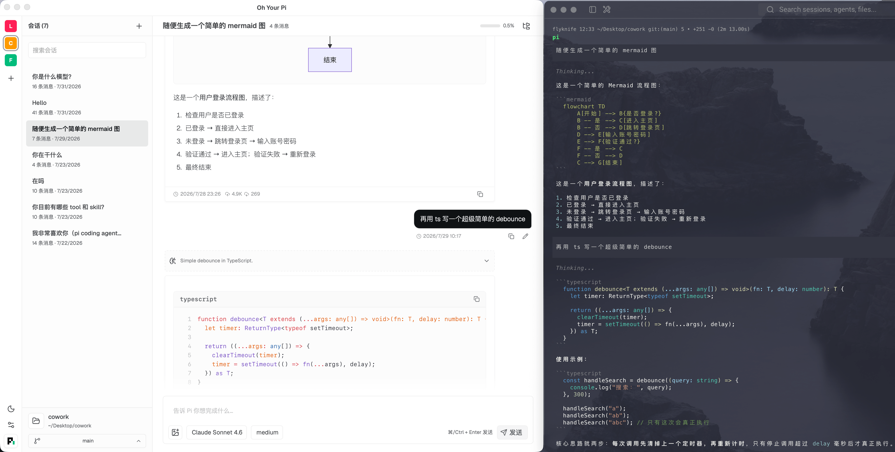

# Oh Your Pi

> [Pi Coding Agent](https://pi.dev/) 的本机桌面客户端。

Oh Your Pi 不重新实现 Agent。它通过 Pi SDK 直接使用你已有的 Pi 配置、认证、模型、扩展、技能、提示模板、上下文文件和原生 JSONL 会话，让桌面界面与 Pi TUI 处于同一套数据体系中。
> [!IMPORTANT]
> ## 下载最新版本
> **[前往 GitHub Releases 下载 →](https://github.com/wind-chasers/oh-your-pi/releases/latest)**
>
> 提供 macOS（Apple Silicon）与 Windows 安装包。



## 特性

- **复用 Pi 原生数据**：读取 `~/.pi/agent` 中已有的认证、模型配置、扩展、技能、提示模板、上下文文件与会话；不复制或迁移 Pi 数据。
- **工作区与会话管理**：浏览工作区会话，创建、打开或继续最近会话，并读取同一项目下的 Pi 原生会话记录。
- **实时对话体验**：流式展示文本、思考过程与工具执行状态；支持发送、引导、跟进和中止会话。
- **模型与授权控制**：选择模型和思考级别；需要授权的工具调用可在界面确认，危险操作会给出明确提示。
- **进程隔离**：React 渲染进程不直接访问 Pi SDK、文件系统或凭据；所有请求经受 Zod 校验的 Electrobun RPC 进入 Bun 主进程。
- **记住窗口位置**：窗口位置和尺寸保存到 `~/.pi/oh-your-pi/window.json`，下次启动时自动恢复。

## 技术栈

- [Electrobun](https://electrobun.dev/) + [Bun](https://bun.sh/)
- React 19 + Vite + TypeScript
- Pi Coding Agent SDK
- Tailwind CSS + Radix UI

## 前置条件

- 已安装 [Bun](https://bun.sh/)。
- 已安装并配置 Pi Coding Agent；Oh Your Pi 会使用本机 Pi 的配置目录和认证状态。

## 开发

```bash
bun install
bun run dev
```

`bun run dev` 会并行启动 Vite 渲染进程和 Electrobun 主进程。

### 常用命令

| 命令 | 用途 |
| --- | --- |
| `bun run dev` | 启动开发环境 |
| `bun run start` | 构建前端并启动 Electrobun |
| `bun run typecheck` | 执行 TypeScript 类型检查 |
| `bun test` | 运行测试 |
| `bun run build` | 构建桌面应用 |
| `bun run build:canary` | 构建 canary 渠道包 |
| `bun run build:stable` | 构建 stable 渠道包 |
| `bun run verify` | 依次执行类型检查、测试和构建 |

## 数据与安全

Pi 是数据的唯一事实来源。应用不会建立平行的会话、插件或凭据存储：Pi 的认证、模型和会话仍由 Pi 管理；Oh Your Pi 自己仅保存窗口状态于 `~/.pi/oh-your-pi/window.json`。渲染进程只接收脱敏后的数据，凭据始终留在 Bun 主进程。

## 项目结构

```text
src/
├── bun/        # Bun 主进程、Pi SDK 适配与 Electrobun RPC
├── mainview/   # React 渲染进程与界面
└── shared/     # 跨进程 Zod DTO 与 RPC 契约
```
