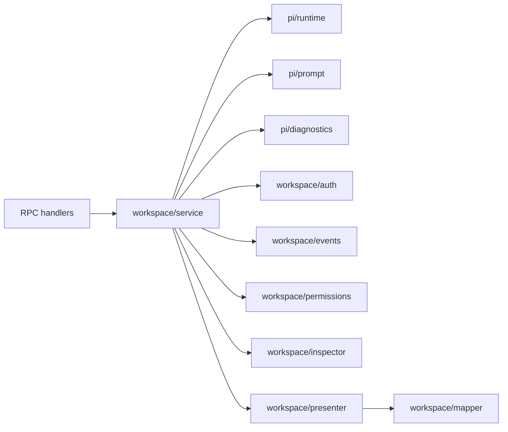

# Bun Pi 模块边界

```text
RPC / UI
  → workspace/service.ts
    → pi/runtime.ts
    → pi/prompt.ts
    → pi/diagnostics.ts
    → workspace/{auth,events,permissions,...}.ts
```

## `src/bun/pi/`：可移植 Pi 基础模块

该目录不依赖 `shared/` 或 `workspace/`。移植到另一个 Bun 客户端时，只需带上 Pi SDK 依赖，并由宿主提供 extension 回调。

| 文件 | 作用 |
|---|---|
| `runtime.ts` | `PiSessionHost` 与 `PiWorkspaceHost`：封装 `createAgentSessionServices` → `createAgentSessionFromServices` 生命周期。workspace host 按路径缓存 live session host；每个 session host 独立绑定 extensions 和 SDK events，切换 UI 会话不会替换或释放其他会话。关闭 host 时显式发出 `session_shutdown`，再 dispose `AgentSession`。`createExtensions` 是宿主注入点，因此该模块不包含 UI 授权或应用 DTO。 |
| `prompt.ts` | `startSessionPrompt`：向 `AgentSession.prompt()` 提交文本；仅等待 Pi preflight 接受，不等待模型完整回答；后续运行失败经 `onError` 上报。 |
| `diagnostics.ts` | OAuth/认证诊断：读取 `auth.json` 元数据而非凭据，识别 OAuth refresh/auth-derivation 失败，生成含运行时、代理环境、认证文件变化和脱敏错误信息的诊断对象。 |
| `redaction.ts` | 纯文本脱敏：隐藏 Bearer token、`sk-*` key，以及常见 `token`、`secret`、`password`、`apiKey` 格式的值。 |

## `src/bun/workspace/`：Oh Your Pi 业务适配层

该目录依赖 `shared/pi-contract`、中文 UI 文案、工具授权策略或 workspace DTO；不作为通用 Pi SDK 模块直接移植。

| 文件 | 作用 |
|---|---|
| `service.ts` | `PiWorkspaceService`：业务总入口。校验 RPC DTO 并编排 workspace/session 操作：检查资源、创建/打开/恢复会话、模型与思考级别切换、prompt/steer/follow-up/abort；同时维护 OAuth 自动恢复与运行时诊断。 |
| `auth.ts` | `PiAuthenticationController`：将 Pi OAuth 登录适配成 `PiAuthenticationEvent`；维护浏览器、设备码、文本输入交互；同一 provider 的 login 与 prompt 串行，避免认证状态竞争。 |
| `events.ts` | `PiSessionEventRelay`：把 SDK `AgentSessionEvent` 转为前端使用的 `PiSessionEvent`，包括文本/thinking 流、工具状态、agent 生命周期和错误。OAuth 恢复决策由 `service.ts` 回调提供。 |
| `inspector.ts` | 扫描 workspace 的 Pi 资源：extensions、skills、prompts、context files、provider 认证可用性、SDK 诊断和已保存会话；输出 `PiWorkspaceSnapshot`，并先脱敏诊断文本。 |
| `mapper.ts` | SDK 数据到应用 DTO 的转换：session summary、模型与 conversation entries；负责界面角色和 OAuth 失败提示。 |
| `presenter.ts` | 组合 runtime state、当前 transcript 与 opened session；只构造前端响应，不执行业务命令。 |
| `permissions.ts` | `ToolPermissionGateway`：作为 Pi extension 拦截工具调用；read/grep/find/ls 默认放行，其余工具请求 UI 授权；识别危险 bash 命令；关闭 session host 时只拒绝并清理该 session 的未决授权。 |

## 依赖方向



结论：`pi/` 负责 SDK 生命周期、prompt 和诊断；`workspace/` 负责本应用的 DTO、UI 事件、安全策略和会话用例。
