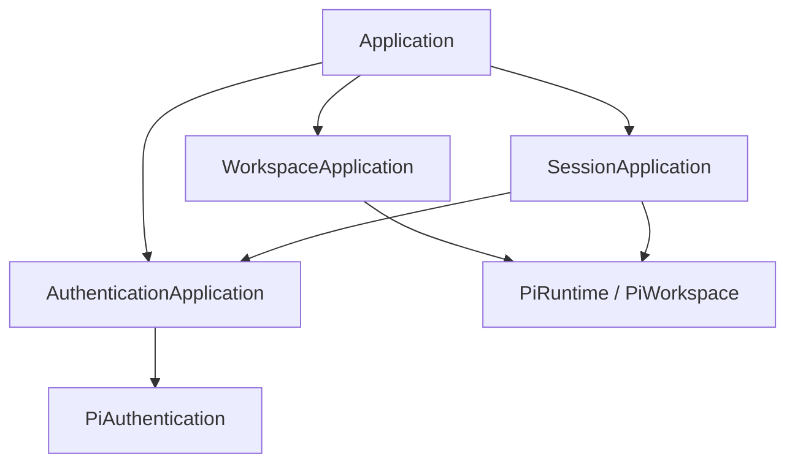

# Bun Application 用例层

本目录位于 RPC/desktop 适配器与 Pi 领域层之间。它拥有用户可见用例、交互状态、DTO 映射和跨领域协调，但不知道 Electrobun 或 React。总体分层见 [`../../../ai.prompt/arch-main.md`](../../../ai.prompt/arch-main.md)。

## 组合关系

- `Application` 是组合根，只组装三个应用服务和完整 workspace snapshot。
- `AuthenticationApplication` 拥有 provider 级串行化、登录取消、待响应 prompt 和认证事件广播。
- `WorkspaceApplication` 拥有工作区资源 DTO、文件 I/O 用例和诊断脱敏。
- `SessionApplication` 拥有 live session 用例、事件桥接、工具授权和认证失败恢复；详细规则见 [`session/ai.prompt.md`](./session/ai.prompt.md)。

## 完整工作区快照

`Application.inspectWorkspace()` 与 `refreshWorkspaceResources()` 负责组合：

1. `WorkspaceApplication` 返回规范化 workspace、agent directory 和资源摘要。
2. `AuthenticationApplication` 返回 provider 状态。
3. `SessionApplication` 返回该 workspace 的持久 session 摘要。
4. `Application` 组装 `PiWorkspaceSnapshot`。

因此 authentication、workspace、session 子服务都不应各自构造完整 snapshot，也不要在 RPC handler 或 Renderer 拼装这份跨领域视图。

## DTO 边界

Pi 领域类型到 `@shared/pi-contract` DTO 的转换属于本层：

- `session/snapshot.ts` 转换 summary、transcript、runtime state 和 opened session。
- `session/events.ts` 转换流式 event，并确保每个 event 带有 `sessionPath`。
- workspace 资源在离开主进程前转换并脱敏。
- authentication 将 SDK 交互转换为稳定的 prompt/event DTO。

不把 SDK object、`Error`、AbortController 或 resolver 传给 RPC。错误可以向外抛出，但跨进程只依赖稳定 message，不依赖 SDK prototype。

## Authentication 所有权

同一 provider 的登录和模型请求通过 `withProviderOperation()` 串行，防止刷新凭据与 prompt 竞争。每个 provider 最多有一个活跃 AbortController；每个交互 prompt 由唯一 ID 对应一个 pending resolver。

取消登录必须 abort provider 操作并拒绝尚未回答的 prompt。dispose 必须完成相同清理，不能让 promise 永久悬挂。打开认证 URL 属于 desktop adapter，因此 application 只发带 URL 的事件，不调用 Electrobun。

## Workspace 所有权

文件列表和读取只能通过 `workspace/files.ts`，路径解析必须限制在目标 workspace 内。Renderer 传入的是 workspace identity 与相对路径，不获得任意主进程文件访问能力。

资源 refresh 会让该 workspace 中 idle 的 live session 重建 SDK services，以读取更新后的 extensions、skills、prompts 和 context；运行中的 session 不重建。

## 依赖与新增能力

- 可以依赖 `@main/pi`、`@shared/pi-contract` 和本目录模块。
- 不导入 Electrobun、BrowserWindow 或 Renderer。
- 跨子域协调放在 `Application`，单域规则留在对应 service。
- 新 RPC 先找到 application 或 desktop owner；RPC handler 只委派。
- 不为 Pi 方法建立一一对应的空转 wrapper。只有当用例需要 DTO 转换、交互状态、授权、安全处理或跨领域协调时才属于本层。

## 验证

改动 workspace snapshot 时检查三个子服务的组合；改动 authentication 时覆盖 provider 串行、prompt response、cancel 和 dispose；改动文件访问时覆盖 workspace 逃逸和二进制/截断行为。最终运行 `bun run verify`，真实系统对话框和 provider 登录另做桌面验证。
