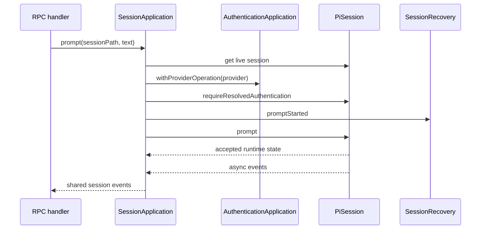
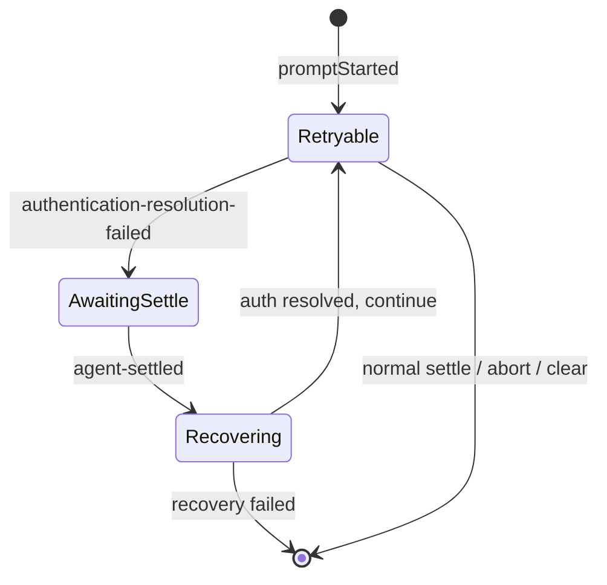

# Session Application

本目录拥有从 Renderer 会话命令到 live `PiSession` 的应用流程，以及从 Pi 领域 event 到共享 DTO event 的反向流程。Pi SDK 生命周期属于 `src/bun/pi/session`；本目录不直接导入 SDK。

## 文件职责

- `index.ts`：打开/创建/继续 session，执行命令，管理 event subscription。
- `snapshot.ts`：领域 snapshot 到共享 DTO。
- `events.ts`：领域 event 到 `PiSessionEvent` DTO。
- `permissions.ts`：工具执行前的用户授权状态。
- `recovery.ts`：认证解析失败的一次性恢复状态机。

## Prompt 路径

只有 `prompt` 在发送前解析 provider 认证并开启恢复窗口。`steer`、`followUp` 和 `abort` 作用于已经打开的 session，保留 Pi 原生语义。模型和 thinking 只能在 session idle 时修改。

## Session subscription

打开、创建或继续 session 后调用 `attachSession()`。同一个 `sessionPath` 最多安装一个 application subscription；registry 返回已有 `PiSession` 时不能重复转发 event。dispose 解除全部 subscription，然后清空 permission、recovery 和外部 listener。

application event 必须携带所属 `sessionPath`。RPC 和 Renderer 依靠该身份隔离并行会话，不能增加“当前活动会话”的全局状态。

## Event 映射

- assistant text/thinking delta 保留增量文本。
- tool start/update/end 保留 tool call ID、名称和最终错误状态。
- agent start/end/settled 与 message end 保留生命周期语义，不合并成单一 finished event。
- `Error` 只转换为可见文本，不能跨进程传递对象。
- `agent-settled` 是一轮运行真正稳定、允许 Renderer 刷新完整 transcript 的信号。

新增 SDK event 时先判断 Renderer 是否存在可观察需求；只转发必要信息，不把 SDK event 原样暴露为公共契约。

## 工具授权

`ToolPermissionApplication` 由 `beforeToolCall` extension hook 进入：

1. 只读工具 `read`、`grep`、`find`、`ls` 直接允许。
2. 其他工具生成唯一 permission ID，并向订阅者广播脱敏、限长后的摘要。
3. 没有订阅者时默认拒绝。
4. response 必须命中仍 pending 的 ID；重复或过期 response 是错误。
5. 用户拒绝后向 Pi 返回明确 reason。
6. application dispose 时所有 pending permission 都以拒绝完成。

危险命令检测只用于提高 UI 警示等级，不能自动允许或自动拒绝，也不能替代真正的 permission decision。

## 认证恢复状态机

恢复只处理 `authentication-resolution-failed`：等待失败轮次 settle，回退到失败 assistant message 的父节点，重新解析凭据，然后调用一次 `continue()`。恢复中的错误作为普通 session error 发给 Renderer。限流、网络、模型、工具以及通用 OAuth 文本匹配都不能进入该状态机。

## 修改与验证

- 改命令语义：覆盖 live session 查找、idle 限制和返回的 runtime state。
- 改 permission：覆盖默认允许、无订阅者拒绝、response、dispose。
- 改 recovery：覆盖错误分类、settle 顺序、单次 continue 和失败清理。
- 改 event/snapshot：同时检查共享 DTO 与 Renderer 消费者。

使用本目录共置测试验证具体状态机，最终运行 `bun run verify`。真实 provider 的认证恢复还需要桌面端到端验证。
