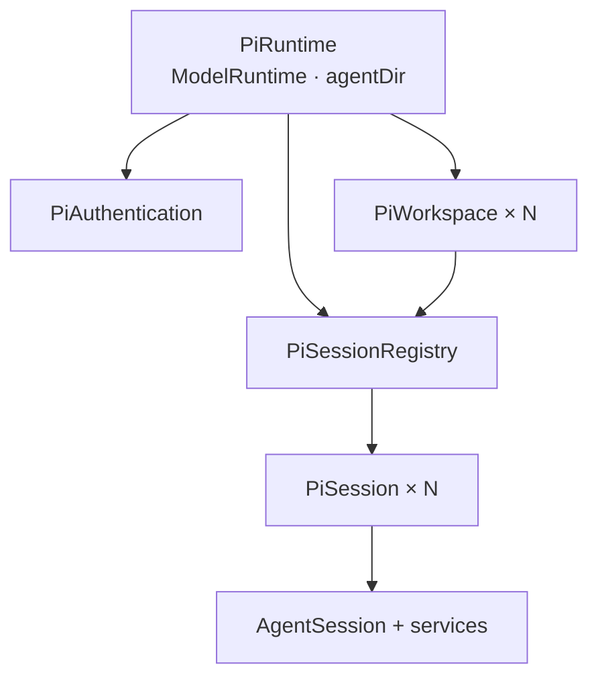

# Pi SDK 运行边界

本目录是项目中唯一直接接触 `@earendil-works/pi-*` 的领域层。主进程总体边界见 [`../../../ai.prompt/arch-main.md`](../../../ai.prompt/arch-main.md)；本文描述 Pi runtime 自身的身份、所有权和生命周期。

## 所有权

- `PiRuntime` 在主进程生命周期内唯一，持有一个 `ModelRuntime`、Pi agent 目录、workspace 缓存和 session registry。
- `PiWorkspace` 以 `realpath` 后的绝对目录为身份。它负责该目录的资源快照和持久 session 入口，不保存“当前会话”。
- `PiSessionRegistry` 以规范化 `sessionPath` 索引所有 live session，合并并发 open，并统一 close/dispose。
- 每个 `PiSession` 独占一个 `AgentSession` 和一组 `AgentSessionServices`；多个会话并行来自多个真实 SDK session，不是前端虚拟状态。
- `PiAuthentication` 使用同一个 `ModelRuntime` 查询 provider 和执行登录，但不保存弹窗、prompt response 或 provider 操作队列；这些交互状态属于上层 application。

## 目录职责

- `runtime.ts`：创建共享 SDK runtime、规范化工作区、管理顶层释放；OAuth flow 注册函数也从这里暴露。
- `workspace.ts`：资源检查、持久 session 列表/读取，以及创建、打开、继续最近 session。
- `authentication.ts`：把 SDK provider 登录能力转换为不依赖 UI 的交互接口。
- `session/registry.ts`：live session 身份与并发打开控制。
- `session/session.ts`：`AgentSession` 生命周期和命令。
- `session/events.ts`：SDK event 到 Pi 领域 event。
- `session/snapshot.ts`：从 SDK session/services 构造领域 snapshot。
- `session/hooks.ts`：把上层授权 hook 注入 SDK extension。
- `errors.ts`：只分类项目需要特殊处理的 Pi 错误。

`index.ts` 是本领域的显式公共面。不要为了缩短 import 暴露 SDK 原始类型或内部 registry/service。

## Session 生命周期

1. workspace 使用 Pi `SessionManager` 找到、创建或继续一个持久 session。
2. registry 以最终 session 文件路径去重，并创建 `PiSession`。
3. `PiSession` 创建 services 和 `AgentSession`，绑定 extensions，然后订阅 SDK event。
4. idle session 资源刷新时可以 `rebuild()`：保留当前树节点，释放旧 runtime，以同一 session 文件重建后恢复节点。
5. close/dispose 必须先解除 event 订阅并发送 `session_shutdown`，再释放 `AgentSession`。

`PiSession.path` 只在 SDK 已产生持久 session 文件后可用；没有路径是错误，不创建临时替代 ID。

## 命令语义

- `prompt()` 在 SDK 接受 prompt 后返回，不等待整轮生成；完整结果由 event 流表达。
- `steer()`、`followUp()` 和 `abort()` 直接保留 SDK 的语义，不在此层增加队列或 UI 策略。
- `setModel()` 必须从当前 `ModelRuntime` 解析真实模型。
- `setThinking()` 只修改当前 live session。
- `requireResolvedAuthentication()` 在发送前验证当前模型能够解析凭据。
- `prepareAuthenticationRetry()` 只负责将 session tree 回到失败 assistant message 的父节点；是否重试以及只能重试几次由 application 层决定。

## 依赖边界

- 可以依赖 Node/Bun 标准能力和 Pi SDK。
- 不导入 `@shared` DTO、Electrobun、Renderer 或 `src/bun/app`。
- 对上暴露 Pi 领域对象和类型；跨进程 DTO 映射由 application 层完成。
- 不复制 Pi 的 auth、models、resources 或 session 数据库，也不自行解析 JSONL 代替 SDK。
- 不增加只转发一次调用的 interface/factory；生命周期 owner 使用具体 class 表达。

## OAuth 与错误

`registerPiOAuthFlows()` 必须在 `PiRuntime.create()` 之前调用。打包后的 Bun 无法可靠处理 SDK OAuth loader 的不透明动态导入，静态注册是运行前置条件。

错误在本层只保留能够改变上层控制流的稳定分类。目前认证解析失败可以被识别；普通 provider、限流、网络、工具或模型错误保持原错误，不在 runtime 内自动重试。

## 验证

修改 SDK 边界前同时核对当前安装版本的 SDK 文档、类型声明和实现。session 接受语义、registry、snapshot、event 或错误分类变化时运行本目录及 `src/bun/app/session` 的相关测试；最终运行 `bun run verify`。真实 OAuth 和 provider 行为必须在打包桌面路径验证。
