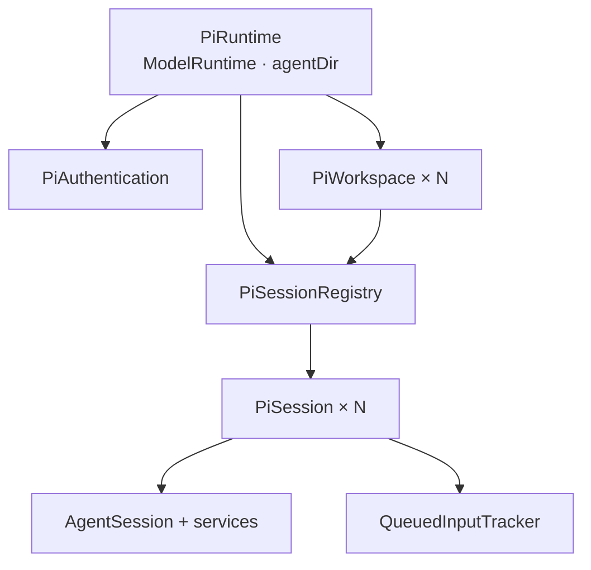

# Pi SDK 运行边界

本目录是项目中唯一直接接触 `@earendil-works/pi-*` 的领域层。主进程总体边界见 [`../../../ai.prompt/arch-main.md`](../../../ai.prompt/arch-main.md)；本文描述 Pi runtime 自身的身份、所有权和生命周期。

## 所有权

- `PiRuntime` 在主进程生命周期内唯一，持有一个 `ModelRuntime`、Pi agent 目录、workspace 缓存和 session registry。
- `PiWorkspace` 以 `realpath` 后的绝对目录为身份。它负责该目录的资源快照和持久 session 入口，不保存“当前会话”。
- `PiSessionRegistry` 以规范化 `sessionPath` 索引所有 live session，合并并发 open，并统一 close/dispose。
- 每个 `PiSession` 独占一个 `AgentSession` 和一组 `AgentSessionServices`；多个会话并行来自多个真实 SDK session，不是前端虚拟状态。
- `PiAuthentication` 使用同一个 `ModelRuntime` 查询 provider 和执行登录，但不保存弹窗、prompt response 或 provider 操作队列；这些交互状态属于上层 application。

## 目录职责

- `runtime.ts`：创建共享 SDK runtime、规范化工作区、管理顶层释放；OAuth flow 注册函数也从这里暴露。
- `workspace.ts`：资源检查、持久 session 列表/读取，以及创建、打开、继续最近 session。
- `authentication.ts`：只包装 provider 查询与登录入口，登录交互直接使用 Pi AI `AuthInteraction` / `AuthEvent` / `AuthPrompt`，不维护中间事件类型。
- `session/registry.ts`：live session 身份与并发打开控制。
- `session/session.ts`：拥有 `AgentSession` 生命周期和命令，转发 SDK event，并在普通 user message 持久化及整轮 settle 后发布 transcript entry 增量；只编排队列追踪器，不保存 queue shadow/confirmation 细节。
- `session/queued-input-tracker.ts`：独占 steer/follow-up sidecar 状态机；同步 SDK queue_update，关联 user message 生命周期与持久 entry，并返回精确 confirmation/clear client IDs。Pi 对纯图片消息不发 removal queue_update，tracker 以图片对象身份认领 client ID，同时保留空字符串 shadow slot 维持后续快照对齐；持久确认只接受原始 user message 对象身份，不按 timestamp 猜测。
- `session/snapshot.ts`：从 `SessionManager.buildContextEntries()` 构造带稳定 entry identity 的共享 transcript；直接使用 Pi AI 与 Agent Core 的精确消息类型，只过滤隐藏 custom message，并移除 assistant `diagnostics` 与 tool/custom arbitrary `details`。
- `session/hooks.ts`：把上层授权 hook 注入 SDK extension。
- `errors.ts`：只分类项目需要特殊处理的 Pi 错误。

`index.ts` 是本领域的显式公共面。优先直接暴露 SDK 已有事实类型；只有项目新增语义时才定义新的 Pi 类型，不暴露内部 registry/service。

## Session 生命周期

1. workspace 使用 Pi `SessionManager` 找到、创建或继续一个持久 session。
2. registry 以最终 session 文件路径去重，并创建 `PiSession`。
3. `PiSession` 创建 services 和 `AgentSession`，绑定 extensions，然后订阅 SDK event。
4. idle session 资源刷新时可以 `rebuild()`：保留当前树节点，释放旧 runtime，以同一 session 文件重建后恢复节点。
5. close/dispose 必须先解除 event 订阅并发送 `session_shutdown`，再释放 `AgentSession`。

`PiSession.path` 只在 SDK 已产生持久 session 文件后可用；没有路径是错误，不创建临时替代 ID。

Pi SDK 的普通 `message_end` 先于 `SessionManager.appendMessage()` 通知订阅者。`PiSession` 因此在该调用栈结束后的 microtask 比较持久 transcript ID：用户 entry 立即发布以确认 Renderer pending message；assistant/tool result 在 `agent_settled` 后批量发布。比较时先在原始 context entries 上求公共前缀，只对变化 tail 做 wire DTO 投影；若旧 ID 不是新路径前缀，则发布 `replaceFrom + tail` 的 `transcript_rebased`。

## 命令语义

- `prompt()` 接收文本与可选 `PiImageAttachmentSource[]`；路径源从文件系统读取，无路径 data 源从 base64 解码，两者都使用 Bun 原生 `Bun.Image` 限制像素、缩放并编码为 Pi `ImageContent`。SDK 接受 prompt 后返回，不等待整轮生成。
- `steer()`、`followUp()` 使用相同图片源语义，并接收 Renderer 的短 `clientId`。独立 `QueuedInputTracker` 用与 SDK queue_update 同步的 sidecar FIFO 跟踪 queued input；`PiSession` 只负责把 tracker 结果编排进 transcript update/event。user message 持久化时发布 `clientId ↔ entryId`，ID 不进入模型上下文或 JSONL。`abort()` 在中止运行前清空 Pi 队列并发布被清理的 client IDs。
- `regenerate()` 只接受当前 live session 中已有后续回复的持久用户 message entry；先通过 Pi 原生 `navigateTree(entryId, { summarize: false })` 回到其父节点，再提交编辑后的 prompt。原 entry 和旧分支保持 append-only；返回的 transcript 是提交新 prompt 前的新分支基线，runtime 是 prompt 被接受后的状态。
- `setModel()` 必须从当前 `ModelRuntime` 解析真实模型。
- `setThinking()` 只修改当前 live session。
- `requireResolvedAuthentication()` 在发送前验证当前模型能够解析凭据。
- `prepareAuthenticationRetry()` 只负责将 session tree 回到失败 assistant message 的父节点；是否重试以及只能重试几次由 application 层决定。
- 每条消息最多 8 张图片，单个路径或内存源解码前最多 64 MB，最多 1 亿像素；图片按顺序逐张处理以限制峰值内存，发送 payload 限制在 provider inline image 上限以内。

## 依赖边界

- 可以运行时依赖 Node/Bun 标准能力和 Pi SDK；可以 type-only 依赖 `@shared` 输出契约。
- 图片管线要求 Bun 1.3.14+ 的 `Bun.Image`。Electrobun 自带的 Bun 版本不能作为隐式假设：`electrobun.config.ts` 固定桌面 Bun 版本，主进程入口调用 `assertPiRuntimeCapabilities()` fail-fast。
- 不依赖 Electrobun、Renderer 或 `src/bun/app`，不把 UI 策略放入 Pi 生命周期 owner。
- SDK 类型若已满足需求就直接复用；只有 RPC 不安全字段才在 shared 契约中派生严格子集，并在本层执行唯一一次裁剪。
- 不复制 Pi 的 auth、models、resources 或 session 数据库，也不自行解析 JSONL 代替 SDK。
- 不增加只转发一次调用的 interface/factory；生命周期 owner 使用具体 class 表达。

## OAuth 与错误

`registerPiOAuthFlows()` 必须在 `PiRuntime.create()` 之前调用。打包后的 Bun 无法可靠处理 SDK OAuth loader 的不透明动态导入，静态注册是运行前置条件。

错误在本层只保留能够改变上层控制流的稳定分类。目前认证解析失败可以被识别；普通 provider、限流、网络、工具或模型错误保持原错误，不在 runtime 内自动重试。

## 验证

修改 SDK 边界前同时核对当前安装版本的 SDK 文档、类型声明和实现。session 接受语义、registry、snapshot、event 或错误分类变化时运行本目录及 `src/bun/app/session` 的相关测试；最终运行 `bun run verify`。真实 OAuth 和 provider 行为必须在打包桌面路径验证。
