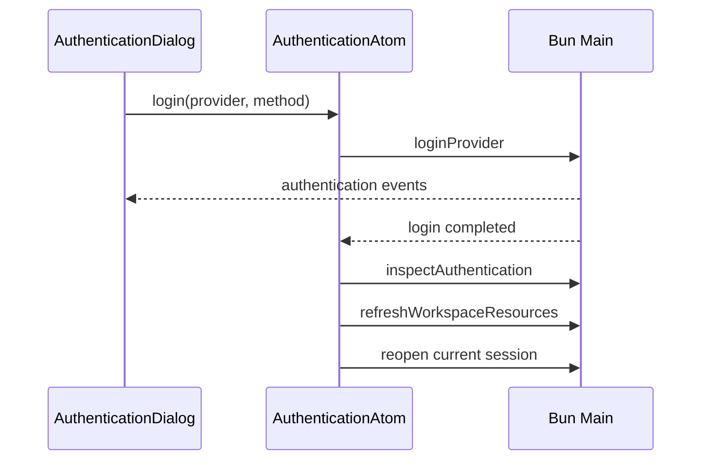

# Renderer 应用状态

本目录只负责窗口顶层组合。Renderer 总体边界见 [`../../../../ai.prompt/arch-render.md`](../../../../ai.prompt/arch-render.md)。工作区级共享状态和操作位于 [`../../states`](../../states)，不要再建立集中式 controller，也不要通过 `AppShell` 层层透传全局状态。

## 组合关系

`AppShell` 只组合三个区域：

- `AppSidebar`：工作区切换、偏好设置和打开认证入口。
- `WorkspacePage`：当前 workspace、session 与文件区域。
- `ProviderAuthenticationDialog`：provider 登录交互。

各区域直接订阅自己需要的 Atom。组件 Props 只表达真正属于父子组件协作的局部状态，例如文件树开关；全局 workspace、session、认证、网络和偏好不得经由 Props 中转。

## 全局状态

| 模块 | 状态或操作 |
|---|---|
| `states/current.atom.ts` | `WorkspaceAtom`、`OpenedSessionAtom` |
| `states/activity.atom.ts` | workspace/authentication busy、顶层错误、计算得出的禁用状态 |
| `states/authentication.atom.ts` | provider 状态、登录流程、认证弹窗开关 |
| `states/preferences.atom.ts` | 最近工作区、是否显示 thinking 及持久化 |
| `states/network.atom.ts` | 浏览器在线状态 |
| `states/theme.atom.ts` | 主题状态及持久化操作 |
| `states/workspace.ts` | 选择、加载工作区的 mutation |
| `states/session.ts` | 打开、创建、继续和刷新 session 的 mutation |

`WorkspaceAtom` 和 `OpenedSessionAtom` 是主进程事实的当前视图副本，不写入 `localStorage`。主题、是否显示 thinking、最近工作区才持久化在浏览器侧。

## 关键流程

### 选择工作区

1. desktop picker 通过 RPC 返回路径。
2. `LoadWorkspaceMutation` 调用 `inspectPiWorkspace()`，以主进程规范化后的 `workspacePath` 更新 `WorkspaceAtom`。
3. 更新 `RecentWorkspacesAtom`。
4. 真正切换到不同 workspace 时清除 `OpenedSessionAtom`。
5. 异步刷新 `AuthenticationAtom`。

### 创建或继续 Session

创建或继续请求与重新检查 workspace 并行执行；当前 workspace 未改变时才更新 `OpenedSessionAtom` 和 `WorkspaceAtom`。失败时保留原视图并设置 `WorkspaceErrorAtom`。

### 刷新 Session

`SessionChat` 收到 `agent_settled` 后调用 `RefreshSessionMutation`：同时读取完整 transcript 和 workspace snapshot，然后只在 workspace 与 session 仍匹配时替换 Atom。增量输出仍属于 `SessionChat` 的局部状态。

### Provider 登录

登录完成后刷新资源，并在已有打开会话时重新打开它，使模型与凭据状态来自重建后的主进程 snapshot。

## 边界

- 定义 Atom 的文件统一使用 `*.atom.ts`；只定义 mutation 的文件保留普通 `*.ts`。
- `states/` 可以调用 `@view/lib/pi-client`；展示组件调用 Atom action 或 mutation 表达意图。
- session event 和 tool permission subscription 属于 `SessionChat`，不提升为全局状态。
- authentication prompt subscription 属于认证弹窗；provider 列表与登录后的全局刷新属于 `AuthenticationAtom`。
- 文件选择、展开和内容加载属于 workspace files hook。
- 只在多个独立区域都需要同一事实时使用 Atom；输入框、弹窗步骤、文件树开关等局部状态继续使用 React state。
- 不为 Atom 再建立 hook/controller 镜像，也不把 Atom 值复制到 React state。
- 状态层不解释 Pi SDK 错误类型，只显示主进程提供的稳定错误文本或操作级 fallback。

## 修改与验证

重点验证工作区切换是否清除旧 session、异步结果是否污染新选择、登录后资源与当前 session 是否刷新，以及 busy 状态是否正确禁用冲突操作。完整交互最终通过 Renderer 路径和 `bun run verify` 验证。
