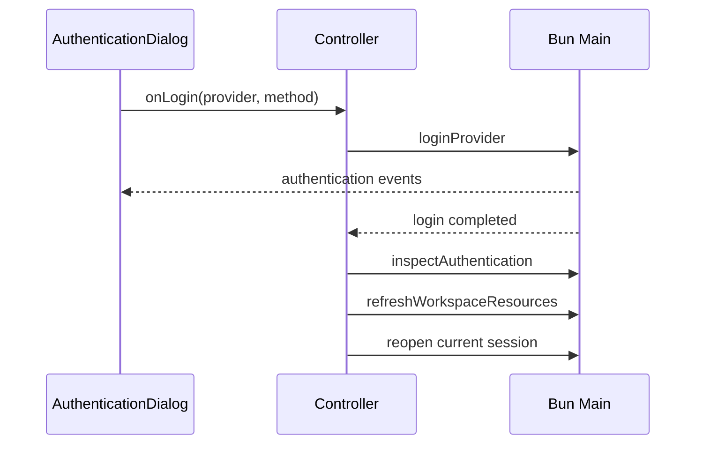

# Renderer 应用控制器

本目录拥有窗口内工作区级状态和顶层页面组合。Renderer 总体边界见 [`../../../../ai.prompt/arch-render.md`](../../../../ai.prompt/arch-render.md)。这里不拥有流式消息细节、文件树内部状态或认证弹窗步骤。

## 组合关系

`AppShell` 只组合三个区域：

- `AppSidebar`：工作区切换、偏好设置和打开认证入口。
- `WorkspacePage`：当前 workspace、session 与文件区域。
- `ProviderAuthenticationDialog`：provider 登录交互。

`useWorkspaceSessionController` 是三者的协调 owner。不要把 RPC 流程重新分散到 `AppShell` 或 sidebar 组件。

## Controller 状态

| 状态 | 含义 |
|---|---|
| `snapshot` | 主进程返回的完整当前 workspace 视图 |
| `openedSession` | 当前打开 session 的 runtime 与完整 transcript |
| `authentication` | provider 可用性摘要 |
| `isLoading` | workspace/session 请求正在切换页面事实 |
| `isAuthenticating` | provider 登录及登录后刷新正在进行 |
| `error` | 顶层工作区操作错误 |
| `isNetworkOnline` | 浏览器网络提示状态，不代替主进程错误 |
| `recentWorkspaces`、`showThinking`、`isDarkMode` | Renderer 偏好 |

`snapshot` 和 `openedSession` 是主进程事实的当前视图副本，不写入 `localStorage`。主题、是否显示 thinking、最近工作区才持久化在浏览器侧。

## 关键流程

### 选择工作区

1. desktop picker 通过 RPC 返回路径。
2. controller 调用 `inspectWorkspace()`，以主进程规范化后的 `workspacePath` 更新 snapshot。
3. 保存最近工作区。
4. 真正切换到不同 workspace 时清除旧 `openedSession`。
5. 异步刷新 authentication 摘要。

### 创建或继续 Session

创建/继续请求与重新检查 workspace 并行执行；成功后原子更新 `openedSession` 和 `snapshot`。失败时保留原视图并设置顶层错误。

### 刷新 Session

`SessionChat` 收到 `agent_settled` 后调用 controller 的 refresh：同时读取完整 transcript 和 workspace snapshot，然后只在当前仍是同一 `sessionPath` 时替换 session 内容。增量输出不能直接写入 workspace snapshot。

### Provider 登录

登录完成后刷新资源，并在已有打开会话时重新打开它，使模型与凭据状态来自重建后的主进程 snapshot。

## 边界

- controller 可以调用 `@view/lib/pi-client`；展示组件通过 Props 表达意图。
- session event 和 tool permission subscription 属于 `SessionChat`，不提升到 controller。
- authentication prompt subscription 属于认证弹窗，provider 列表与登录后的全局刷新属于 controller。
- 文件选择、展开和内容加载属于 workspace files hook。
- 普通页面状态使用 React state；不要为这些状态再建立 atom 镜像。
- controller 不解释 Pi SDK 错误类型，只显示主进程提供的稳定错误文本或操作级 fallback。

## 修改与验证

修改 controller 时重点验证工作区切换是否清除旧 session、session 异步结果是否污染新选择、登录后资源与当前 session 是否刷新，以及 loading/authentication 是否正确禁用冲突操作。偏好变更使用共置纯函数测试；完整交互最终通过 Renderer 路径和 `bun run verify` 验证。
