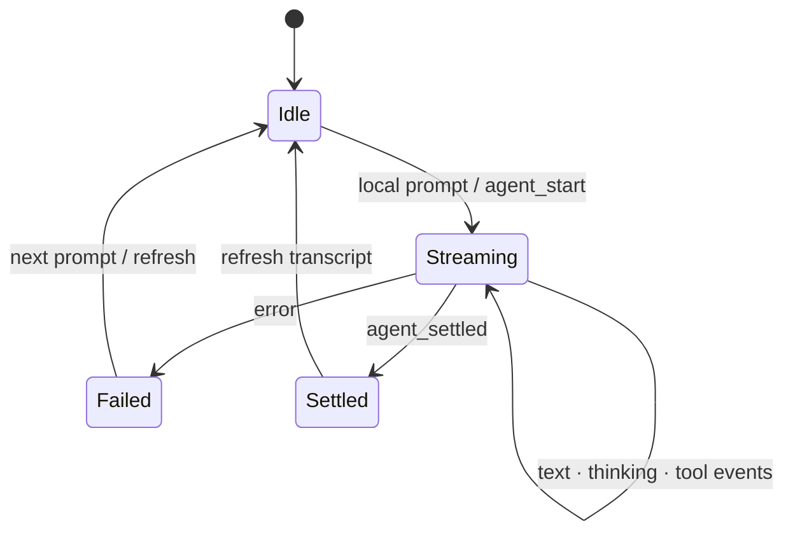

# Session 会话界面

本目录拥有一个已打开 session 的交互界面：完整 transcript 展示、当前轮次增量状态、输入命令、模型/thinking 选择和工具授权。它不打开工作区、不选择持久 session，也不保存 Pi 的持久事实。

## 状态分层

`openedSession` Props 是主进程返回的稳定基线：

- `transcript.entries`：最近一次完整刷新后的持久内容。
- `runtime`：session identity、模型、thinking 和 streaming 状态。

`SessionChat` 内部状态只表达尚未并入完整 transcript 的当前轮次：

- `pendingUserMessage`
- `streamedText` 与 `thinkingText`
- tool call 状态表
- permission request 队列
- draft、sending、streaming 和局部错误

切换 `sessionPath` 时必须清空上一会话的所有增量文本、tool 和 permission 状态，并以新 `openedSession.runtime.isStreaming` 初始化界面。

## Event 处理

每个 session event 和 permission request 都必须先比较 `sessionPath`；不属于当前打开 session 的事件直接忽略。

- `agent_start`：清空上一轮增量状态并进入 streaming。
- `assistant_text_delta` / `assistant_thinking_delta`：按到达顺序追加。
- `tool_start` / `tool_end`：按 `toolCallId` 更新同一工具状态。
- `error`：显示错误、移除乐观 user message 并退出 streaming。
- `agent_settled`：清空临时状态、退出 streaming，并请求 controller 重新读取完整 transcript。

`agent_end` 不是最终刷新点；恢复逻辑可能仍在主进程继续，只有 `agent_settled` 表示该轮稳定。

## 输入语义

- idle 时提交：先显示 `pendingUserMessage`，乐观进入 streaming，再调用 `promptPiSession()`。
- streaming 时普通提交：调用 `steerPiSession()`，把文本送入当前轮次。
- streaming 时 follow-up：调用 `followUpPiSession()`，排入下一轮。
- abort：调用主进程后退出本地 streaming；最终 transcript 仍以之后的刷新结果为准。
- 空文本、重复 sending、没有可用凭据或当前模型没有可用认证时不发送。

不要等待 `promptPiSession()` 返回完整回复；它只确认主进程接受命令。输出完全由 event subscription 驱动。

## 工具授权

permission request 按到达顺序排队，界面一次展示队首请求。带 `toolCallId` 的请求同时把对应工具标记为 `awaiting_permission`。提交允许/拒绝后，只有主进程确认 response 成功才从队列移除；拒绝会将对应工具标记为失败完成。

切换 session 时丢弃本地队列，但不能伪造 response。真正 pending permission 的生命周期和默认拒绝策略属于 Bun 主进程。

## 组件边界

- `index.tsx`：订阅、状态机和命令协调。
- `chat/ChatTranscript.tsx`：组合持久 entries 与当前增量内容。
- `chat/messages/`：按消息类型渲染，不发起 RPC。
- `chat/ChatComposer.tsx`：输入、发送动作和模型可用性展示。
- `chat/ModelThinkingSelector.tsx`：模型与 thinking 选择；运行中禁止切换。
- `chat/ToolPermissionPrompt.tsx`：只展示当前 permission 并返回决定。
- `settings/`、`export/`：session 附属界面；不能各自维护第二份 transcript。

只有本目录的会话协调层调用 session command/event API。展示组件通过 Props 工作，不直接订阅 `pi-client`。

## 验证

行为变化应覆盖：

- 切换 session 后旧 event 和 permission 不污染新会话。
- prompt 的乐观 user message、请求失败回滚和 settled 后完整刷新。
- text/thinking 增量拼接和 tool 状态转换。
- streaming 时 steer、follow-up、abort 的区别。
- 缺少凭据或模型时显示认证入口而不是可用发送动作。

优先扩展 `chat/SessionChat.test.tsx` 中可观察 UI 合约；涉及真实 event/RPC 时使用 Renderer 路径验证，最终运行 `bun run verify`。
