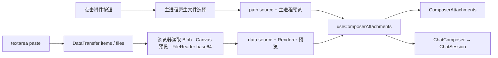

# Chat Composer

本目录负责会话输入区的纯 UI 状态与用户输入意图：草稿由 `SessionProvider` 作用域内的 `ChatEditorAtom` 持有，待发送图片与预览仍由 `ChatComposer` 持有；本目录还负责粘贴解析、模型/thinking 选择和发送操作。会话事实与命令生命周期属于 [`../../../../../../chat-store/ai.prompt.md`](../../../../../../chat-store/ai.prompt.md)；图片的可信解码与最终编码属于主进程 `src/bun/pi/session/image-attachments.ts`。

## 模块结构

- `ChatComposer.tsx`：订阅草稿是否有效，协调输入框、附件列表、工具栏和错误展示；不直接调用 RPC。
- `Editor.tsx`：订阅完整 draft，渲染受控 textarea，并把输入与提交快捷键转成编辑器状态和表单意图。
- `ComposerAttachments.tsx`：渲染待发送缩略图，提供移除与全屏预览入口。
- `ComposerToolbar.tsx`：图片选择、模型/thinking、认证、follow-up 与发送按钮。
- `ModelThinkingSelector.tsx`：只通过 `ChatSession` 修改模型与 thinking；运行中锁定。
- `use-composer-attachments.ts`：统一原生选择与粘贴附件的合并、去重、数量上限、busy/error 和预览索引。
- `paste.ts`：从 textarea paste 事件的 `DataTransfer` 读取无路径二进制图片并生成 Renderer 预览。
- `paste.test.ts`：验证 clipboard item 优先级、files fallback 和非栅格内容过滤。
- `index.ts`：Composer 模块公共出口。

共享的全屏查看器位于 `../ImagePreviewDialog.tsx`，Composer 和历史用户消息共同使用。

## 数据模型

```ts
type PiImageAttachmentSource =
  | { type: "path"; path: string }
  | { type: "data"; data: string; mimeType: string; name: string };

type PiImageAttachment = {
  id: string;
  source: PiImageAttachmentSource;
  name: string;
  previewDataUrl: string;
  width: number;
  height: number;
};
```

`PiImageAttachment` 是发送前 UI 模型：既包含最终发送源，也包含缩略图和显示元数据。`source` 才会进入会话命令；`previewDataUrl`、Renderer 读取的宽高与名称不能作为主进程可信事实。

- 原生文件选择产生 `path` source。
- 截图软件或剪贴板 Blob/File 产生 `data` source，不创建临时文件，也不假设存在系统路径。

## 输入流程



### 原生选择

`choose()` 调用 `choosePiImageAttachments()`。文件对话框、路径规范化、图片解码和预览生成都在主进程执行；Renderer 只接收已经检查过的附件 UI 模型。

### 粘贴

`ChatComposer` 的 `onPaste` 把 `event.clipboardData` 立即交给 `paste()`，不调用 `preventDefault()`，因此普通文本粘贴仍走浏览器默认行为。

`paste.ts` 的规则：

1. 优先读取 `DataTransfer.items` 中 `kind === "file"` 的图片。
2. 没有可用 item 时回退到 `DataTransfer.files`。
3. 接受栅格 `image/*`，明确排除 SVG。
4. 无文件名时生成 `剪贴板图片 N.<ext>`。
5. 使用浏览器图片解码和 Canvas 生成最长边不超过 1600 的 WebP 预览。
6. 使用 `FileReader` 保留原始二进制的 base64，构造 `data` source。
7. 只处理当前附件容量内的图片，避免无界解码大量 clipboard items。

粘贴读取不经过 RPC；只有用户真正发送时，原始 base64 才进入会话 RPC。

## 附件状态不变量

- draft 由 `ChatEditorAtom` 保存：`Editor` 通过 `useDraft` 订阅完整文本并逐字更新，`ChatComposer` 只通过 `useValid` 订阅“trim 后是否非空”；有效性不变时，草稿输入不会触发整个 Composer 重渲染。
- 未发送附件属于 `ChatComposer` 的纯 UI state。draft 与附件都不进入 Chat Store；发送成功后重置，发送失败时保留供重试。
- 每条消息最多 8 张图片。
- 单个源最多 64 MiB、最多 1 亿像素。
- 原生路径按规范化 path 去重；内存图片按 attachment ID 区分，不对大体积 base64 做内容哈希。
- `isAdding` 合并选择中与粘贴处理中状态，禁止并发添加覆盖附件数组，也会阻止 prompt、steer 与 follow-up，直到附件完整进入待发送状态。
- 删除附件会关闭当前预览并清除附件局部错误。
- 预览索引超出附件数组时自动关闭预览。
- 允许只有图片、没有文本的消息。

## 模型与发送约束

- 当前模型必须声明 `input.includes("image")` 才启用附件按钮。
- 如果选好图片后切换到不支持图像的模型，附件不会静默丢失，但发送会被禁用并显示恢复提示。
- `canCompose` 取决于可用认证与模型；`canSend` 还要求附件不在处理中、存在文本或附件，且没有不受支持的附件。
- idle 使用 `session.prompt({ text, attachments })`；streaming 普通发送使用 `session.steer({ text, attachments })`；显式“排队后续”使用 `session.followUp({ text, attachments })`。
- `ChatComposer` 只表达用户意图；命令校验、RPC error、optimistic tail 和运行中队列状态由 `ChatSession` 负责。
- steer / follow-up 被 Pi 交付前显示在 Composer 上方的“待处理消息”列表；两类队列分开保存并固定先显示调整当前任务，再显示后续任务。

## 预览体验

- Composer 上方以横向缩略图列表展示待发送图片。
- 单张图片可独立移除。
- `ImagePreviewDialog` 覆盖完整 viewport，提供上一张、下一张、左右方向键、Escape、关闭按钮、背景点击关闭、序号与文件名。
- 历史 user message 从 Pi transcript 的 `ImageContent` 构造 data URL，并复用同一个全屏查看器。

## 边界与安全

- Renderer 预览是体验数据，不是发送 payload，也不是可信验证结果。
- `data` source 的 MIME、名称和 base64 都来自 Renderer；主进程必须重新检查数量、编码长度、解码后大小、像素和真实图片可解码性。
- 不在 Renderer 安装图片处理依赖；预览使用 Web API，最终发送处理使用 Bun 原生 `Bun.Image`。
- `Bun.Image` 从 Bun 1.3.14 起可用；`electrobun.config.ts` 必须将 `build.bunVersion` 固定在 1.3.14 或更高版本，主进程启动时还会显式检查该能力。
- 不把未发送附件放入 Chat Store，避免后台会话缓存长期持有大块原始 base64。

## 修改与验证

- 改粘贴来源识别：更新 `paste.ts` 与 `paste.test.ts`，再用真实 `ClipboardEvent + DataTransfer` 验证。
- 改附件上限或源结构：同步 `@shared/pi-contract`、Chat Store 校验和主进程图片管线。
- 改发送行为：同时覆盖纯图片、prompt、steer 和 follow-up。
- 改预览：验证 Composer 与历史 user message 两个入口。
- 最终运行 `bun run verify`；当前附件相关行为还应定向运行 `paste.test.ts`、`chat-store/utils.test.ts`、`pi/runtime.test.ts`、`image-attachments.test.ts` 和 `pi/session/session.test.ts`，并使用 Electrobun 配置下载的 Bun 实际执行一次图片预览处理。
