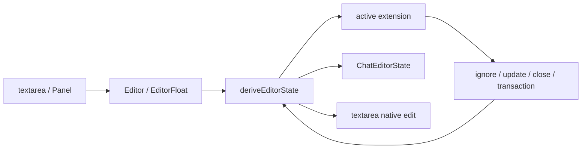

# Chat Editor

本目录实现会话输入框及其 Extension Framework。草稿和活跃 extension 由 `SessionProvider` 作用域内的 `ChatEditorAtom` 持有；发送、附件和会话命令属于上层 [`../ai.prompt.md`](../ai.prompt.md)。

## 心智模型

先把整套机制理解成一台小型状态机：

> `Editor` 把浏览器事件翻译成统一事件；`deriveEditorState` 负责调度；当前 extension 决定事件的含义并返回结果。



职责边界：

- `Editor`：DOM、键盘和光标事件的适配层。
- `deriveEditorState`：状态机和唯一调度中心。
- `framework.ts`：插件协议和公共数据结构，不包含具体插件业务。
- registry：建立 trigger 到 extension 的映射。
- extension strategy：解释 token、命令和 Panel event。
- `Panel`：插件自己的浮层 UI。
- `source`：插件自己的候选数据。

## 模块结构

- `index.tsx`：公共 `Editor`；创建稳定 textarea ref，把 DOM 输入和按键翻译为 framework 事件，并应用 extension 文本编辑。
- `Float.tsx`：通过 `PopoverAnchor.virtualRef` 定位 textarea，挂载当前 extension 的完整 Panel，并把 Panel event 转发给 runtime。
- `state.ts`：定义 `ChatEditorState` 与 derive runtime；路由 input、selection、command 和 Panel event，统一消费 extension result、更新状态、应用文本编辑并执行 effect。
- `framework.ts`：定义 extension 协议、语义命令、文本事务及范围校验。
- `framework.test.ts`：覆盖 registry、trigger 恢复、token transition、事务和 DOM input 回声。
- `extensions/index.ts`：静态 registry；校验唯一 extension ID、唯一单字符 trigger。
- `extensions/shared/`：内置插件复用的 token 和列表 helper，不属于 framework contract。
- `extensions/{filemention,skill,commands}/`：每个插件分别拥有 `model.ts`、`source.ts`、`strategy.ts`、`Panel.tsx` 和组装入口 `index.ts`。

## 核心状态

```ts
interface ChatEditorState {
  draft: string;
  active: {
    extension: RegisteredEditorExtension;
    state: any;
  } | null;
}
```

`draft` 是 textarea 的完整文本。`active === null` 表示编辑器处于空闲态；否则保存当前 extension 实例和这一次运行产生的插件状态。

例如输入 `@src/a` 后，状态大致是：

```ts
{
  draft: "@src/a",
  active: {
    extension: fileExtension,
    state: {
      trigger: "@",
      triggerIndex: 0,
      tokenEnd: 6,
      query: "src/a",
      activeIndex: 0,
    },
  },
}
```

extension 是 registry 中的固定对象；state 属于本次激活。active 直接保存 extension 实例，后续 transition、command 和 Panel 渲染不再按 ID 查询。

`ChatEditorAtom` 在 [`../../../session.atom.ts`](../../../session.atom.ts) 中组装。framework 统一看到的注册类型使用 `any`，但 `defineEditorExtension()` 会保留每个插件内部 state 和 Panel event 的具体类型。

订阅保持拆分：

- `EditorTextarea` 只订阅 `useDraft()`。
- `EditorFloat` 只订阅 `useFloatState()`。
- `ChatComposer` 只订阅 `useValid()`。

不要把候选列表、统一 active index、loading/empty/error UI 或插件私有状态提升进 framework。

## Extension 协议

一个 extension 需要提供：

```ts
interface EditorExtension<TState, TPanelEvent> {
  id: string;
  triggers: readonly string[];
  activate(context: EditorTriggerContext): TState | null;
  transition(
    state: TState,
    event: EditorExtensionEvent,
    context: EditorExtensionContext,
  ): EditorExtensionTransition<TState>;
  handleCommand(
    state: TState,
    command: EditorCommand,
    context: EditorExtensionContext,
  ): EditorExtensionResult<TState>;
  handlePanelEvent(
    state: TState,
    event: TPanelEvent,
    context: EditorExtensionContext,
  ): EditorExtensionResult<TState>;
  Panel: ComponentType<EditorExtensionPanelProps<TState, TPanelEvent>>;
  surface?: EditorExtensionSurface;
}
```

可以把这些成员理解为：

| 成员 | 职责 |
| --- | --- |
| `triggers` | 声明哪些单字符可以启动插件 |
| `activate` | 首次触发时创建插件状态 |
| `transition` | 文本或光标变化后更新 token/query，或关闭插件 |
| `handleCommand` | 处理方向键、Enter、Tab、Escape |
| `handlePanelEvent` | 处理 hover、click 等 Panel 事件 |
| `Panel` | 完整拥有浮层内容 |
| `surface` | 配置浮层宽度、方向和偏移 |

## 三条事件通道

### 1. Input / Selection

来源是输入、删除、粘贴和光标变化：

```ts
editor.input(input);
editor.selectionChange(selectionStart, selectionEnd);
```

活跃时交给：

```ts
active.extension.transition(active.state, event, context);
```

这条通道持续维护 token 和 query，只返回 `update` 或 `close`。

IME 组合期间仍同步 draft，但不执行 extension transition，且跳过临时组合选区；composition commit 后的普通 input 才更新 token/query。

### 2. Command

`EditorTextarea` 把按键翻译成与插件业务无关的语义命令：

- `ArrowUp` / `ArrowDown` → `navigate`
- 无修饰键的 `Enter` / `Tab` → `accept`
- `Escape` → `cancel`
- `Ctrl+Enter` / `Meta+Enter` → form submit，优先于 extension
- `Shift+Enter` 和 `Shift+Tab` 保留原生行为

命令交给：

```ts
active.extension.handleCommand(active.state, command, context);
```

### 3. Panel event

Panel 通过私有事件描述 hover、click 等交互：

```tsx
onSelect={({ path }) => dispatch({ type: "select", path })}
```

链路是：

```text
Panel → EditorFloat → dispatchExtensionEvent()
      → extension.handlePanelEvent() → applyResult()
```

鼠标点击和键盘接受最终进入同一个 result 处理流程，因此文本、浮层和光标行为一致。

## 完整触发流程：以 `@src/a` 为例

### 1. 输入 `@`

textarea 的 `onChange` 构造 `EditorInput`，其中包含最新 draft、本次插入文本、输入类型和选区。

`state.input()` 发现当前没有 active extension，于是调用 `activate()`。

### 2. 识别 trigger

`getInsertedTrigger()` 只检查本次是否插入了一个单字符：

1. 优先读取 `InputEvent.data`。
2. WebView 缺少 `data` 或 `inputType` 时，用“新 draft 删除光标前一字符后严格等于旧 draft”恢复 trigger。
3. 不扫描已有 draft，也不依次调用全部插件。

输入 `@` 时得到：

```ts
{ character: "@", index: triggerIndex }
```

### 3. Registry 找到文件插件

Registry 的核心映射是：

```ts
Map {
  "@" => fileExtension,
  "#" => skillExtension,
  "/" => commandExtension,
}
```

`getEditorExtensionByTrigger("@")` 返回 `fileExtension`，然后调用 `fileExtension.activate()` 创建初始状态：

```ts
{
  trigger: "@",
  triggerIndex,
  tokenEnd: triggerIndex + 1,
  query: "",
  activeIndex: 0,
}
```

`active` 从 `null` 变成 `{ extension: fileExtension, state }`，`EditorFloat` 随即渲染 `FileMentionPanel`。

### 4. 继续输入 `src/a`

已有 active extension 时不再查 registry，而是调用：

```ts
fileExtension.transition(state, inputEvent, context);
```

文件插件复用 `transitionTokenState()` 重新计算：

```ts
query = "src/a";
tokenEnd = trigger 后第一个 break character 的位置；
```

query 变化时文件插件把 `activeIndex` 重置为 0，Panel 根据新 query 过滤候选列表。

### 5. 方向键导航

ArrowDown 被翻译为：

```ts
{ type: "navigate", direction: "next" }
```

文件插件返回：

```ts
{ type: "update", state: { ...state, activeIndex: nextIndex } }
```

`applyResult()` 只更新插件状态；draft 不变，Panel 重新渲染高亮项。

### 6. Enter 接受候选

假设当前候选是 `src/a.ts`，插件返回声明式 transaction：

```ts
{
  type: "transaction",
  transaction: {
    close: true,
    edit: {
      from: state.triggerIndex + 1,
      to: state.tokenEnd,
      insert: "src/a.ts",
      cursor: state.triggerIndex + 1 + "src/a.ts".length,
    },
  },
}
```

它表达的是：保留 `@`，把 query 替换为完整路径，关闭插件，并把光标放到文件名末尾。插件不直接操作 textarea DOM。

## Token 状态机

共享 `TokenExtensionState` 保存：

```ts
interface TokenExtensionState {
  trigger: string;
  triggerIndex: number;
  tokenEnd: number;
  query: string;
}
```

`transitionTokenState()` 从 trigger 后开始扫描，直到插件定义的第一个 break character。它在以下情况关闭插件：

- 创建了选区。
- 光标移动到 trigger 前或 trigger 上。
- 原 trigger 被删除或替换。
- 光标越过 tokenEnd。

break character 属于插件规则：文件路径允许 `/` 和 `.`，Skill、Command 可以有不同边界。

如果当前 extension 因本次输入关闭，runtime 会再次用同一个 input 尝试 `activate()`。这样输入另一个 trigger 时可以直接切换插件，例如当前 Skill token 被 `/` 终止后，同一个 `/` 仍可激活 Command extension。

`input()` 遇到 `event.draft === current.draft` 必须直接返回。这会过滤原生 DOM 编辑同步回来的 input 回声；真正的 undo/redo 改变了 draft，仍会正常进入状态机。

## Extension Result

`handleCommand()` 和 `handlePanelEvent()` 返回四种结果，由 `deriveEditorState.applyResult()` 统一消费：

| Result | 含义 |
| --- | --- |
| `ignore` | 插件不处理；返回 `false`，调用方保留浏览器默认行为 |
| `update` | 只更新插件 state，不修改 draft |
| `close` | 清空 active，不修改 draft |
| `transaction` | 原子更新 draft/active，可应用文本编辑并执行 effect |

这种设计保证插件只声明意图，状态更新、范围校验、DOM 编辑和 effect 顺序由 runtime 统一控制。

## 文本事务与原生撤销

Extension 不能直接操作 textarea DOM，只能返回：

```ts
interface EditorTextEdit {
  from: number;
  to: number;
  insert: string;
  cursor: number;
}
```

`applyResult()` 的顺序固定为：

1. `applyEditorTextEdit()` 校验范围和最终光标并计算新 draft。
2. 原子更新 draft/active。
3. 通过 `onEdit(edit)` 让 `Editor` 应用 textarea DOM 编辑。
4. 执行可选 transaction effect。
5. 返回是否处理，供键盘层决定是否 `preventDefault()`。

DOM 层随后：

1. 聚焦 textarea 并选择 `[from, to)`。
2. 使用 `document.execCommand("insertText")` 写入 `insert`。
3. 下一帧恢复 transaction 指定的 cursor。

这里使用 `execCommand("insertText")` 是有意的：它会把替换或删除写入 textarea 原生 undo 栈，而 `setRangeText()` 或只修改受控 `value` 不能提供相同行为。Electrobun 默认使用系统 WebView；替换实现或调整构建引擎前，必须在目标 WebView 中验证补全后 `undo` 能恢复原 token。

`execCommand` 会触发 `input`，`setSelectionRange` 会触发 selection 事件：

- input 回声因 draft 已同步而被 `state.input()` 的同值短路忽略。
- 当前内置事务都关闭 active extension，因此后续 selection 是无操作。
- 真正的 undo/redo 会产生不同 draft，必须继续通过 `onChange` 同步回 atom。

## 浮层与 Panel 所有权

`EditorFloat` 只负责：

- Popover root、portal、virtual anchor 和 surface 配置。
- 阻止浮层自动抢焦点或关闭后强制恢复焦点。
- 挂载 `active.extension.Panel`。
- 把 Panel event 转发给 `dispatchExtensionEvent()`。

Panel 完整拥有 header、候选项、loading、empty、error、鼠标交互和展示结构。内置 `ExtensionList` 只是可选 helper。焦点始终留在 textarea。

## 内置 Extensions

- `file`，trigger `@`：允许路径中的 `/` 和 `.`，选择后把 query 替换为完整路径并保留 `@`；候选来自主进程搜索服务（`searchWorkspaceFiles` RPC），目录候选保留尾部 `/` 且接受后不关闭 token，可继续下钻。
- `skill`，trigger `#`：候选来自 `WorkspaceAtom.resources.skillDetails` 的 workspace snapshot；Panel 以名称和描述做本地模糊筛选，选择后把整个 token 替换为 `[#skill:name]`。
- `command`，trigger `/`：当前 mock 选择后删除整个 `/token`。

`skill` 的候选已在 workspace 加载或资源 refresh 时进入 Renderer，不为 query 发 RPC；Panel 计算筛选结果后通过 `dispatch({ type: "results", ... })` 回写插件 state，键盘和鼠标都从该 state 读取同一份候选。`command` 的 `source.ts` 目前仍是同步 mock；`file` 已接入真实异步数据。异步候选属于插件内部，不修改 framework 协议：Panel 通过 `dispatch({ type: "search", ... })` 把搜索结果回写到插件 state（`files`/`status`），键盘命令和 Panel 点击都从 `state.files` 读取同一份候选。query 变化时 `transition` 把 `status` 置为 `loading` 并清空候选，Panel 的 effect 防抖 60ms 后发起 RPC，用请求序号丢弃过期响应；`degraded` 状态表示 fd 不可用、结果仅来自单层目录匹配。不要把异步候选协议加入 framework。

## 新增 Extension

1. 定义插件私有 model、state 和 Panel event。
2. 实现 `activate`、`transition`、`handleCommand`、`handlePanelEvent`。
3. Panel 自行读取 source 并渲染全部内容。
4. 用 `defineEditorExtension()` 组装，声明唯一 `id`、单字符 `triggers` 和可选 `surface`。
5. 注册到 `extensions/index.ts`。
6. 为激活、阻断、导航、接受事务和 Panel 渲染补充定向测试。

核心编辑器不应知道新 trigger 代表什么；新增插件通常不需要修改 `index.tsx`、`state.ts` 或 `Float.tsx`。

## 修改与验证

- 改 trigger/registry：覆盖重复 ID、重复 trigger 和单字符约束。
- 改词法/token：覆盖插入、删除、选区、光标移出和 break character。
- 改 transaction：验证范围异常、最终 draft、光标、键盘接受、鼠标接受及原生 undo。
- 改按键：同时验证有候选、无候选、组合输入和修饰键。
- 改浮层：在真实 Electrobun WebView 中验证定位、滚动和 textarea 焦点；静态渲染测试不能证明 Popover 行为。
- 定向命令：`bun test src/mainview/biz/workspace/sessions/session/chat/composer/editor/framework.test.ts`。
- 类型检查：`bun run typecheck`。
