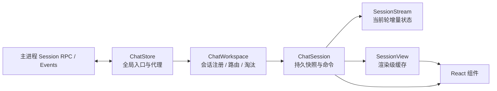

# Chat Store

本目录是 Renderer 中所有会话数据的长期内存层。组件只消费 Chat Store，不负责打开会话、订阅主进程事件、拼接流或维护工具授权状态。

当前业务组件尚未迁移到本目录；迁移时必须删除组件内重复的 `pi-client` 会话订阅、流状态和 render item 计算，不能让两套状态源长期并存。

## 为什么独立存在

- React 组件会随路由和会话切换而卸载，但主进程任务可能仍在运行。
- 切回会话时应直接复用完整 transcript、当前流和渲染缓存，不能重新拉取后才开始渲染。
- 主进程只发全局事件。Renderer 必须把事件转发给对应 workspace/session，才能同时处理多个后台会话。
- 内存不能无限增长。长期无消费者、无请求且非 streaming 的会话必须自动淘汰。



## 文件职责

- `index.ts`：公共出口和 React `useChatSession` 绑定。
- `types.ts`：公开快照、临时工具状态、活动状态和配置类型。
- `utils.ts`：无状态的身份校验、runtime 合并、依赖比较和输入校验。
- `session.ts`：单个会话的稳定快照、主进程命令、加载与 transcript 刷新生命周期。
- `session-stream.ts`：当前轮流式文本、thinking、临时工具、授权、事件 generation 和 hydrate 前事件队列。
- `session-view.ts`：绑定一个 `ChatSession`，缓存 transcript 到 `SessionViewItem` 的渲染级转换结果。
- `workspace.ts`：以 session ID 注册会话，负责本工作区的打开、创建、继续、事件分派和闲置淘汰。
- `store.ts`：薄代理层；维护 workspace 集合、安装唯一全局订阅，并把 API 和事件转交给 workspace。

只有形成独立所有权和生命周期的职责才拆文件。不要把单个事件分支或 RPC 包装继续拆成无意义小文件。

## 身份与索引

- `sessionId` 是会话身份，也是 `ChatWorkspace.sessions` 唯一索引。
- `sessionPath` 不是索引，只是当前主进程 RPC 和 event contract 使用的定位信息。
- `ChatStore` 不持有任何 session 索引，更不能维护 `sessionsByPath` 一类平行注册表。
- 由于当前 session event 只携带 `sessionPath`，`ChatStore` 将事件广播给 workspace；workspace 在自己的 ID 索引值中定位路径并交给 session。以后 event contract 携带 session ID 时，可直接按 ID 分派。
- hydrate 时必须同时校验 runtime/transcript 的 session ID、session path 和 workspace path。

## 所有权边界

### `ChatStore`

`ChatStore` 只承担跨 workspace 的薄层能力：

- 全局只安装一份 session event 和 tool permission subscription；
- 获取或创建 `ChatWorkspace`；
- 把 `session/open/create/continue` API 代理给对应 workspace；
- 周期性触发各 workspace 的闲置清理；
- 将主进程事件依次交给 workspace，首个接受者处理。

不得在 `ChatStore` 增加 session 注册表、session 缓存或具体流状态处理。

### `ChatWorkspace`

- `Map<sessionId, ChatSession>` 是会话唯一注册表。
- 负责 session 的创建、打开、继续和 RPC 返回后的安装。
- 负责把只携带 path 的主进程事件分派给所属 session。
- 负责淘汰本工作区内不活跃 session。
- 当前选中哪个 session 属于界面导航状态，不能影响后台 session 生命周期。

### `ChatSession`

- 持有稳定的 `ChatSessionSnapshot`，供 `useSyncExternalStore` 消费。
- 负责加载、刷新、prompt、steer、follow-up、abort、模型切换、thinking 切换和工具授权响应。
- 持有 `SessionStream` 和 `SessionView`，但不自行实现它们内部的流归并或渲染计算。
- `agent_settled` 后刷新持久 transcript；刷新完成前保留增量内容，防止界面空白闪烁。

### `SessionStream`

- 处理 `PiSessionEvent` 和 tool permission request。
- 保存尚未进入持久 transcript 的文本、thinking、工具状态和授权队列。
- 用 generation 隔离 settle refresh 与后来启动的新任务，旧刷新不能清掉新流。
- session hydrate 前到达的事件在这里有界排队，hydrate 后按原顺序重放。

### `SessionView`

`SessionView` 只处理渲染级派生数据，不调用 RPC，也不拥有主进程状态：

- `items` 按 transcript entries 对象身份缓存；会话切走再切回时直接复用。
- 不生成空 assistant item；只有文本、thinking 或错误文本时才渲染 assistant。
- 连续的 tool-call-only assistant entries 合并为一个 `tool-section` ViewItem。
- tool result 与 tool call 在这里配对，组件不重复扫描 transcript。
- `cache(key, dependencies, calculate)` 为后续其他 session 级渲染计算提供通用缓存。

旧的 `chat/render-items.ts` 在业务组件迁移到 `SessionView` 后应删除，不能长期维护两份规则。

## 快照语义

`ChatSessionSnapshot` 是完整的会话 UI 输入：

- `sessionId`：稳定身份，与 workspace 中的 Map key 一致。
- `sessionPath`：主进程当前定位路径，不作为内存索引。
- `phase`：`idle | loading | ready | failed`，描述首次加载状态。
- `openedSession`：持久 transcript 与 runtime 的最近快照。
- `streamedText` / `thinkingText` / `tools`：尚未并入 transcript 的当前轮增量。
- `pendingUserMessage`：prompt 已乐观提交、但尚未被 transcript 收录的用户消息。
- `permissionRequests`：当前会话待处理授权，按到达顺序排列。
- `isRefreshing` 与 `isSending`：后台拉取和命令请求状态。
- `error`：最近一次加载、命令、事件或刷新失败。

快照对象只在状态发布时替换。`getSnapshot` 必须返回已保存对象，不能临时组装新对象。

## 生命周期与淘汰

默认闲置超时为 10 分钟，每分钟由 `ChatStore` 触发各 workspace 扫描。以下任一条件成立时 session 禁止淘汰：

- 存在 React subscription 或显式 `acquire()` consumer；
- 有 load、refresh 或 command 请求在途；
- runtime 仍为 streaming；
- 存在待处理工具授权。

淘汰只释放 Renderer 内存，不关闭主进程 session。空 workspace 只有在没有 create/continue 请求在途时才从 Store 移除。

## React 接入

```ts
useChatSession(workspacePath, sessionId, sessionPath)
```

返回 `[snapshot, session]`。三个参数都必须是已经确定的非空字符串；会话尚未选定时，调用方不应渲染使用该 hook 的组件。

- hook 自动 acquire、打开、订阅并在卸载时 release；
- 展示读取 `snapshot` 和 `session.view.items`；
- 用户意图调用 `session.prompt()`、`session.abort()` 等方法；
- 组件不得直接调用 session RPC、订阅 session events 或重新计算 ViewItem。

## 关键不变量

1. session 只按 ID 注册和读取；path 绝不能成为 session Map key。
2. 同一个 session ID 不能在一个 workspace 中对应两个 path，同一个 path 也不能对应两个 ID。
3. `ChatStore` 不拥有 session 索引和 session 业务状态。
4. streaming session 即使没有可见组件也必须持续处理事件，不能被淘汰。
5. 事件必须先由 workspace 隔离到 session，再修改流状态。
6. settle refresh 只可清理触发它的那一代流。
7. `SessionView` 是渲染级 transcript 转换的唯一归属，组件不维护平行缓存。
