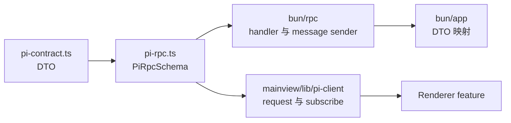

# 跨进程契约

本目录是 Bun 主进程与 Renderer 之间的静态线协议。系统边界继承 [`../../ai.prompt/architecture.md`](../../ai.prompt/architecture.md)；本文只约束 DTO 的表达方式和契约演进。

## 文件职责

- `pi-contract.ts` 定义 request、response、snapshot 和 event DTO。
- `pi-rpc.ts` 将这些 DTO 组装为 Electrobun 的 `PiRpcSchema`。

这里不拥有业务行为。认证、会话、文件和权限规则由 Bun 主进程实现；Renderer 只能消费契约暴露的数据。

## 身份约定

- `workspacePath` 是工作区身份。检查工作区、列文件、读文件以及读取或打开持久 session 时必须显式携带它。
- `sessionPath` 是 live session 身份。模型、thinking、prompt、steer、follow-up、abort 和流式 event 都以它路由。
- 读取或打开已有 session 同时携带 `workspacePath` 与 `sessionPath`，由主进程验证归属；已经打开后的命令只携带 `sessionPath`。
- `provider + modelId` 标识模型；不要引入仅供 UI 使用的第二套模型 ID。
- 时间跨进程时使用字符串，不传 `Date` 实例。

## DTO 约定

1. 只使用可结构化克隆的普通对象、数组、字符串、数字、布尔值、`null` 和必要的 optional 字段。
2. 不传 class、SDK 对象、`Error`、`AbortSignal`、函数、`Map`、`Set` 或文件句柄。
3. 固定形状的 event 优先使用显式可空字段，例如 `PiSessionEvent`；只在“字段整体不存在”本身有语义时使用 optional。
4. DTO 名称表达应用概念，不暴露 Pi SDK 内部类型名。
5. 凭据、token、API key、完整认证文件和未经脱敏的工具输入不得进入契约。
6. 契约由 TypeScript 与 Electrobun schema 提供静态约束，不增加 Zod schema 或 `.parse()` 包装。

## 契约流向

`pi-contract.ts` 不依赖其他项目层；`pi-rpc.ts` 只依赖契约类型和 Electrobun 的 schema 类型。禁止从这里导入 Bun application、Pi SDK、React 或 Renderer feature。

## 修改协议

新增或改变跨进程能力时按以下顺序检查完整链路：

1. 在 `pi-contract.ts` 定义最小 DTO；优先复用已有 workspace/session 身份类型。
2. 在 `pi-rpc.ts` 声明 request/response 或单向 message。
3. 在 `src/bun/rpc/index.ts` 绑定真正的 application/desktop owner。
4. 在 `src/mainview/lib/pi-client.ts` 暴露业务命名的函数或订阅。
5. 更新消费方，并检查所有旧字段和旧调用是否完成干净切换。

request 用于需要调用方等待接受、结果或错误的操作；message 用于主进程主动产生的流式事件。不要用 message 模拟 request，也不要让 request 等待完整流式生成结束。

## 验证

契约变化至少运行 `bun run typecheck` 和受影响的 RPC/application 测试；最终运行 `bun run verify`。检查的不只是编译，还包括 request 是否由正确 owner 处理、事件是否携带正确身份以及 DTO 是否遗漏敏感数据。
